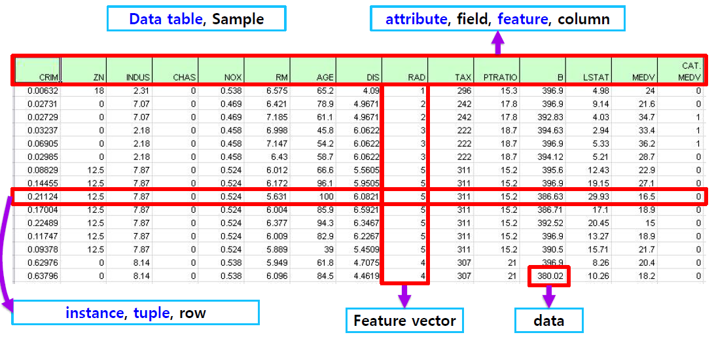
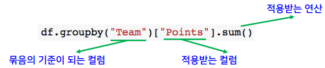
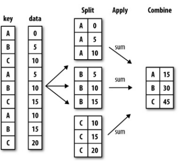
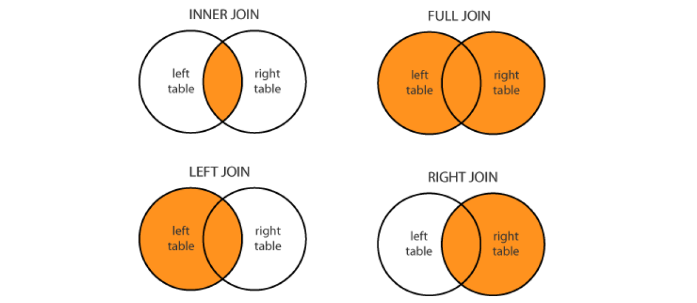

# 👀 Pandas Cheatsheet


```python
import numpy as np
import pandas as pd
import matplotlib.pyplot as plt
%matplotlib inline

import warnings
warnings.filterwarnings("ignore")
```

## 1. Pandas
구조화된 데이터의 처리를 지원하는 Python 라이브러리로 주로 데이터 처리 및 통계 분석을 위해 사용한다.


### 1.1. Terminology



## 2. Data Load
### 2.1. read_csv


```python
data_url = 'https://archive.ics.uci.edu/ml/machine-learning-databases/housing/housing.data'
# CSV 데이터 로드, 구분자는 연속된 공백, 컬럼은 없음
df = pd.read_csv(data_url, sep='\s+', header=None)
# 처음 다섯줄 출력
df.head()
```


<div>
<style scoped>
    .dataframe tbody tr th:only-of-type {
        vertical-align: middle;
    }

    .dataframe tbody tr th {
        vertical-align: top;
    }

    .dataframe thead th {
        text-align: right;
    }
</style>
<table border="1" class="dataframe">
  <thead>
    <tr style="text-align: right;">
      <th></th>
      <th>0</th>
      <th>1</th>
      <th>2</th>
      <th>3</th>
      <th>4</th>
      <th>5</th>
      <th>6</th>
      <th>7</th>
      <th>8</th>
      <th>9</th>
      <th>10</th>
      <th>11</th>
      <th>12</th>
      <th>13</th>
    </tr>
  </thead>
  <tbody>
    <tr>
      <th>0</th>
      <td>0.00632</td>
      <td>18.0</td>
      <td>2.31</td>
      <td>0</td>
      <td>0.538</td>
      <td>6.575</td>
      <td>65.2</td>
      <td>4.0900</td>
      <td>1</td>
      <td>296.0</td>
      <td>15.3</td>
      <td>396.90</td>
      <td>4.98</td>
      <td>24.0</td>
    </tr>
    <tr>
      <th>1</th>
      <td>0.02731</td>
      <td>0.0</td>
      <td>7.07</td>
      <td>0</td>
      <td>0.469</td>
      <td>6.421</td>
      <td>78.9</td>
      <td>4.9671</td>
      <td>2</td>
      <td>242.0</td>
      <td>17.8</td>
      <td>396.90</td>
      <td>9.14</td>
      <td>21.6</td>
    </tr>
    <tr>
      <th>2</th>
      <td>0.02729</td>
      <td>0.0</td>
      <td>7.07</td>
      <td>0</td>
      <td>0.469</td>
      <td>7.185</td>
      <td>61.1</td>
      <td>4.9671</td>
      <td>2</td>
      <td>242.0</td>
      <td>17.8</td>
      <td>392.83</td>
      <td>4.03</td>
      <td>34.7</td>
    </tr>
    <tr>
      <th>3</th>
      <td>0.03237</td>
      <td>0.0</td>
      <td>2.18</td>
      <td>0</td>
      <td>0.458</td>
      <td>6.998</td>
      <td>45.8</td>
      <td>6.0622</td>
      <td>3</td>
      <td>222.0</td>
      <td>18.7</td>
      <td>394.63</td>
      <td>2.94</td>
      <td>33.4</td>
    </tr>
    <tr>
      <th>4</th>
      <td>0.06905</td>
      <td>0.0</td>
      <td>2.18</td>
      <td>0</td>
      <td>0.458</td>
      <td>7.147</td>
      <td>54.2</td>
      <td>6.0622</td>
      <td>3</td>
      <td>222.0</td>
      <td>18.7</td>
      <td>396.90</td>
      <td>5.33</td>
      <td>36.2</td>
    </tr>
  </tbody>
</table>
</div>


`data_columns`로 **컬럼 이름 지정**도 가능하다.


```python
df.data_columns =  ["CRIM", "ZN", "INDUS", "CHAS", "NOX", "RM", "AGE", "DIS", "RAD", "TAX", "PTRATIO", "B", "LSTAT", "MEDV"]
df.head()
```


<div>
<style scoped>
    .dataframe tbody tr th:only-of-type {
        vertical-align: middle;
    }

    .dataframe tbody tr th {
        vertical-align: top;
    }

    .dataframe thead th {
        text-align: right;
    }
</style>
<table border="1" class="dataframe">
  <thead>
    <tr style="text-align: right;">
      <th></th>
      <th>0</th>
      <th>1</th>
      <th>2</th>
      <th>3</th>
      <th>4</th>
      <th>5</th>
      <th>6</th>
      <th>7</th>
      <th>8</th>
      <th>9</th>
      <th>10</th>
      <th>11</th>
      <th>12</th>
      <th>13</th>
    </tr>
  </thead>
  <tbody>
    <tr>
      <th>0</th>
      <td>0.00632</td>
      <td>18.0</td>
      <td>2.31</td>
      <td>0</td>
      <td>0.538</td>
      <td>6.575</td>
      <td>65.2</td>
      <td>4.0900</td>
      <td>1</td>
      <td>296.0</td>
      <td>15.3</td>
      <td>396.90</td>
      <td>4.98</td>
      <td>24.0</td>
    </tr>
    <tr>
      <th>1</th>
      <td>0.02731</td>
      <td>0.0</td>
      <td>7.07</td>
      <td>0</td>
      <td>0.469</td>
      <td>6.421</td>
      <td>78.9</td>
      <td>4.9671</td>
      <td>2</td>
      <td>242.0</td>
      <td>17.8</td>
      <td>396.90</td>
      <td>9.14</td>
      <td>21.6</td>
    </tr>
    <tr>
      <th>2</th>
      <td>0.02729</td>
      <td>0.0</td>
      <td>7.07</td>
      <td>0</td>
      <td>0.469</td>
      <td>7.185</td>
      <td>61.1</td>
      <td>4.9671</td>
      <td>2</td>
      <td>242.0</td>
      <td>17.8</td>
      <td>392.83</td>
      <td>4.03</td>
      <td>34.7</td>
    </tr>
    <tr>
      <th>3</th>
      <td>0.03237</td>
      <td>0.0</td>
      <td>2.18</td>
      <td>0</td>
      <td>0.458</td>
      <td>6.998</td>
      <td>45.8</td>
      <td>6.0622</td>
      <td>3</td>
      <td>222.0</td>
      <td>18.7</td>
      <td>394.63</td>
      <td>2.94</td>
      <td>33.4</td>
    </tr>
    <tr>
      <th>4</th>
      <td>0.06905</td>
      <td>0.0</td>
      <td>2.18</td>
      <td>0</td>
      <td>0.458</td>
      <td>7.147</td>
      <td>54.2</td>
      <td>6.0622</td>
      <td>3</td>
      <td>222.0</td>
      <td>18.7</td>
      <td>396.90</td>
      <td>5.33</td>
      <td>36.2</td>
    </tr>
  </tbody>
</table>
</div>


## 3. Series
데이터프레임 중 **하나의 컬럼**에 해당하는 데이터 객체
- `numpy.ndarray`의 서브 클래스이다.
- 데이터 타입은 모든 자료형 사용 가능하다.
- 인덱스 라벨은 정렬할 필요가 없다.
- 중복이 가능하다.

### 3.1. Series 생성

#### 3.1.1. 리스트


```python
# 리스트로 데이터 생성
list_data = [1, 2, 3, 4, 5]
example_obj = pd.Series(data=list_data)
example_obj
```


    0    1
    1    2
    2    3
    3    4
    4    5
    dtype: int64


```python
# 리스트로 인덱스와 데이터 리스트를 따로 만들어 지정 가능
list_data = [1, 2, 3, 4, 5]
list_name = ["a", "b", "c", "d", "e"]
example_obj = pd.Series(data=list_data, index=list_name)
example_obj
```


    a    1
    b    2
    c    3
    d    4
    e    5
    dtype: int64


#### 3.1.2. 딕셔너리


```python
# 딕셔너리로 인덱스를 지정하여 데이터 생성
dict_data = {"a": 1, "b": 2, "c": 3, "d": 4, "e": 5}
# dtype으로 자료형 지정, name으로 Series의 이름 지정
example_obj = pd.Series(dict_data, dtype=np.int16, name="exmaple_obj")
example_obj
```


    a    1
    b    2
    c    3
    d    4
    e    5
    Name: exmaple_obj, dtype: int16


```python
# 다시 dict로 변환 가능
example_obj.to_dict()
```


    {'a': 1, 'b': 2, 'c': 3, 'd': 4, 'e': 5}


```python
# 항상 인덱스를 기준으로 Series를 생성
dict_data_2 = {"a": 1, "b": 2, "c": 3, "d": 4, "e": 5}
indexes = ["a", "b", "c", "d", "e", "f", "g", "h"]
example_obj_2 = pd.Series(dict_data_2, index=indexes)
example_obj_2
```


    a    1.0
    b    2.0
    c    3.0
    d    4.0
    e    5.0
    f    NaN
    g    NaN
    h    NaN
    dtype: float64


### 3.2. Series의 속성

#### 3.2.1. name - 테이블 이름


```python
example_obj.name = "series name what?"
example_obj
```


    a    1
    b    2
    c    3
    d    4
    e    5
    Name: series name what?, dtype: int16


#### 3.2.2. index - 인덱스 객체


```python
# Series의 인덱스 객체반환
example_obj.index
```


    Index(['a', 'b', 'c', 'd', 'e'], dtype='object')


```python
# 인덱스의 이름도 설정 가능
example_obj.index.name = "index name what?"
example_obj
```


    index name what?
    a    1
    b    2
    c    3
    d    4
    e    5
    Name: series name what?, dtype: int16


#### 3.2.3. values


```python
# Series의 데이터(value)를 반환하며 자료형은 numpy.ndarray
print("series.values의 자료형 :", type(example_obj.values))
example_obj.values
```

    series.values의 자료형 : <class 'numpy.ndarray'>
    


    array([1, 2, 3, 4, 5], dtype=int16)


### 3.3. Series와 in 연산자


```python
# Index(Key) 값 여부를 확인
print("b exists?", "b" in example_obj)
print("z exists?", "z" in example_obj)
```

    b exists? True
    z exists? False
    

### 3.4. Series의 데이터 접근


```python
# Index 인덱싱으로 접근 가능
example_obj["a"]
```


    1


```python
# 접근한 인덱스에 값 할당 가능
example_obj["a"] = 10
example_obj
```


    index name what?
    a    10
    b     2
    c     3
    d     4
    e     5
    Name: series name what?, dtype: int16


### 3.5. astype - 자료형 지정


```python
# 데이터의 자료형 변경
# 저장시 다시 할당해줘야 한다
example_obj = example_obj.astype(np.float64)
example_obj
```


    index name what?
    a    10.0
    b     2.0
    c     3.0
    d     4.0
    e     5.0
    Name: series name what?, dtype: float64


```python
example_obj
```


    index name what?
    a    10.0
    b     2.0
    c     3.0
    d     4.0
    e     5.0
    Name: series name what?, dtype: float64


## 4. Dataframe
데이터 테이블 전체를 포함하는 객체
- `numpy` 배열과 비슷하다.
- 각 컬럼이 각자 다른 자료형을 가지고 있다.
- 행과 열에 각각 인덱스가 있다.
- 컬럼은 삽입하고 삭제하면서 크기를 조절할 수 있다.

### 4.1. Dataframe 생성


```python
# 출처: https://chrisalbon.com/python/pandas_map_values_to_values.html
raw_data = {
    "first_name": ["Jason", "Molly", "Tina", "Jake", "Amy"],
    "last_name": ["Miller", "Jacobson", "Ali", "Milner", "Cooze"],
    "age": [42, 52, 36, 24, 73],
    "city": ["San Francisco", "Baltimore", "Miami", "Douglas", "Boston"],
}
```


```python
# 딕셔너리의 key값에 대응해서 DataFrame 생성
column_names1 = ["first_name", "last_name", "age", "city"]
df = pd.DataFrame(raw_data, columns=column_names1)
df
```


<div>
<style scoped>
    .dataframe tbody tr th:only-of-type {
        vertical-align: middle;
    }

    .dataframe tbody tr th {
        vertical-align: top;
    }

    .dataframe thead th {
        text-align: right;
    }
</style>
<table border="1" class="dataframe">
  <thead>
    <tr style="text-align: right;">
      <th></th>
      <th>first_name</th>
      <th>last_name</th>
      <th>age</th>
      <th>city</th>
    </tr>
  </thead>
  <tbody>
    <tr>
      <th>0</th>
      <td>Jason</td>
      <td>Miller</td>
      <td>42</td>
      <td>San Francisco</td>
    </tr>
    <tr>
      <th>1</th>
      <td>Molly</td>
      <td>Jacobson</td>
      <td>52</td>
      <td>Baltimore</td>
    </tr>
    <tr>
      <th>2</th>
      <td>Tina</td>
      <td>Ali</td>
      <td>36</td>
      <td>Miami</td>
    </tr>
    <tr>
      <th>3</th>
      <td>Jake</td>
      <td>Milner</td>
      <td>24</td>
      <td>Douglas</td>
    </tr>
    <tr>
      <th>4</th>
      <td>Amy</td>
      <td>Cooze</td>
      <td>73</td>
      <td>Boston</td>
    </tr>
  </tbody>
</table>
</div>


```python
# 일부만 가져와서 생성 가능
column_names2 = ["age", "city"]
pd.DataFrame(raw_data, columns=column_names2)
```


<div>
<style scoped>
    .dataframe tbody tr th:only-of-type {
        vertical-align: middle;
    }

    .dataframe tbody tr th {
        vertical-align: top;
    }

    .dataframe thead th {
        text-align: right;
    }
</style>
<table border="1" class="dataframe">
  <thead>
    <tr style="text-align: right;">
      <th></th>
      <th>age</th>
      <th>city</th>
    </tr>
  </thead>
  <tbody>
    <tr>
      <th>0</th>
      <td>42</td>
      <td>San Francisco</td>
    </tr>
    <tr>
      <th>1</th>
      <td>52</td>
      <td>Baltimore</td>
    </tr>
    <tr>
      <th>2</th>
      <td>36</td>
      <td>Miami</td>
    </tr>
    <tr>
      <th>3</th>
      <td>24</td>
      <td>Douglas</td>
    </tr>
    <tr>
      <th>4</th>
      <td>73</td>
      <td>Boston</td>
    </tr>
  </tbody>
</table>
</div>


```python
# 딕셔너리에 없는 값이면 새로운 컬럼을 생성하고 NaN으로 채움
column_names3 = ["first_name", "last_name", "age", "city", "debt"]
pd.DataFrame(raw_data, columns=column_names3)
```


<div>
<style scoped>
    .dataframe tbody tr th:only-of-type {
        vertical-align: middle;
    }

    .dataframe tbody tr th {
        vertical-align: top;
    }

    .dataframe thead th {
        text-align: right;
    }
</style>
<table border="1" class="dataframe">
  <thead>
    <tr style="text-align: right;">
      <th></th>
      <th>first_name</th>
      <th>last_name</th>
      <th>age</th>
      <th>city</th>
      <th>debt</th>
    </tr>
  </thead>
  <tbody>
    <tr>
      <th>0</th>
      <td>Jason</td>
      <td>Miller</td>
      <td>42</td>
      <td>San Francisco</td>
      <td>NaN</td>
    </tr>
    <tr>
      <th>1</th>
      <td>Molly</td>
      <td>Jacobson</td>
      <td>52</td>
      <td>Baltimore</td>
      <td>NaN</td>
    </tr>
    <tr>
      <th>2</th>
      <td>Tina</td>
      <td>Ali</td>
      <td>36</td>
      <td>Miami</td>
      <td>NaN</td>
    </tr>
    <tr>
      <th>3</th>
      <td>Jake</td>
      <td>Milner</td>
      <td>24</td>
      <td>Douglas</td>
      <td>NaN</td>
    </tr>
    <tr>
      <th>4</th>
      <td>Amy</td>
      <td>Cooze</td>
      <td>73</td>
      <td>Boston</td>
      <td>NaN</td>
    </tr>
  </tbody>
</table>
</div>


### 4.2. DataFrame의 컬럼 선택


```python
# 방법 1. 인덱싱
df["first_name"]
```


    0    Jason
    1    Molly
    2     Tina
    3     Jake
    4      Amy
    Name: first_name, dtype: object


```python
# 방법 2. 객체 속성 "."으로 접근
df.first_name
```


    0    Jason
    1    Molly
    2     Tina
    3     Jake
    4      Amy
    Name: first_name, dtype: object


### 4.4. Dataframe 인덱싱

#### 4.4.1. loc - 명칭 기반 인덱싱


```python
# loc[추출하려는 인덱스 리스트, 추출하려는 컬럼이름 리스트]
df.loc[[0, 1, 2], ["first_name", "last_name"]]
```


<div>
<style scoped>
    .dataframe tbody tr th:only-of-type {
        vertical-align: middle;
    }

    .dataframe tbody tr th {
        vertical-align: top;
    }

    .dataframe thead th {
        text-align: right;
    }
</style>
<table border="1" class="dataframe">
  <thead>
    <tr style="text-align: right;">
      <th></th>
      <th>first_name</th>
      <th>last_name</th>
    </tr>
  </thead>
  <tbody>
    <tr>
      <th>0</th>
      <td>Jason</td>
      <td>Miller</td>
    </tr>
    <tr>
      <th>1</th>
      <td>Molly</td>
      <td>Jacobson</td>
    </tr>
    <tr>
      <th>2</th>
      <td>Tina</td>
      <td>Ali</td>
    </tr>
  </tbody>
</table>
</div>


```python
# 컬럼 인덱스에 컬럼 이름 문자열만 오면 Series를 반환
print("자료형 :", type(df.loc[:, "last_name"]))
df.loc[:, "last_name"]
```

    자료형 : <class 'pandas.core.series.Series'>
    


    0      Miller
    1    Jacobson
    2         Ali
    3      Milner
    4       Cooze
    Name: last_name, dtype: object


```python
# 컬럼 인덱스에 컬럼 이름으로 이루어진 리스트가 오면 DataFrame을 반환
print("자료형 :", type(df.loc[:, ["last_name"]]))
df.loc[:, ["last_name"]]
```

    자료형 : <class 'pandas.core.frame.DataFrame'>
    


<div>
<style scoped>
    .dataframe tbody tr th:only-of-type {
        vertical-align: middle;
    }

    .dataframe tbody tr th {
        vertical-align: top;
    }

    .dataframe thead th {
        text-align: right;
    }
</style>
<table border="1" class="dataframe">
  <thead>
    <tr style="text-align: right;">
      <th></th>
      <th>last_name</th>
    </tr>
  </thead>
  <tbody>
    <tr>
      <th>0</th>
      <td>Miller</td>
    </tr>
    <tr>
      <th>1</th>
      <td>Jacobson</td>
    </tr>
    <tr>
      <th>2</th>
      <td>Ali</td>
    </tr>
    <tr>
      <th>3</th>
      <td>Milner</td>
    </tr>
    <tr>
      <th>4</th>
      <td>Cooze</td>
    </tr>
  </tbody>
</table>
</div>


#### 4.4.2. iloc - 위치 기반 인덱싱


```python
# iloc[인덱스 인덱싱/슬라이싱, 컬럼 위치 인덱싱/슬라이싱]
df.iloc[:2, :2]
```


<div>
<style scoped>
    .dataframe tbody tr th:only-of-type {
        vertical-align: middle;
    }

    .dataframe tbody tr th {
        vertical-align: top;
    }

    .dataframe thead th {
        text-align: right;
    }
</style>
<table border="1" class="dataframe">
  <thead>
    <tr style="text-align: right;">
      <th></th>
      <th>first_name</th>
      <th>last_name</th>
    </tr>
  </thead>
  <tbody>
    <tr>
      <th>0</th>
      <td>Jason</td>
      <td>Miller</td>
    </tr>
    <tr>
      <th>1</th>
      <td>Molly</td>
      <td>Jacobson</td>
    </tr>
  </tbody>
</table>
</div>


```python
# 컬럼을 숫자로 지정하여 접근
# 컬럼 인덱스에 정수만 들어갈 경우 Series를 반환
df.iloc[:, 1]
```


    0      Miller
    1    Jacobson
    2         Ali
    3      Milner
    4       Cooze
    Name: last_name, dtype: object


```python
# 컬럼 인덱스에 정수 리스트가 오면 DataFrame을 반환
df.iloc[:, 1:3]
```


<div>
<style scoped>
    .dataframe tbody tr th:only-of-type {
        vertical-align: middle;
    }

    .dataframe tbody tr th {
        vertical-align: top;
    }

    .dataframe thead th {
        text-align: right;
    }
</style>
<table border="1" class="dataframe">
  <thead>
    <tr style="text-align: right;">
      <th></th>
      <th>last_name</th>
      <th>age</th>
    </tr>
  </thead>
  <tbody>
    <tr>
      <th>0</th>
      <td>Miller</td>
      <td>42</td>
    </tr>
    <tr>
      <th>1</th>
      <td>Jacobson</td>
      <td>52</td>
    </tr>
    <tr>
      <th>2</th>
      <td>Ali</td>
      <td>36</td>
    </tr>
    <tr>
      <th>3</th>
      <td>Milner</td>
      <td>24</td>
    </tr>
    <tr>
      <th>4</th>
      <td>Cooze</td>
      <td>73</td>
    </tr>
  </tbody>
</table>
</div>


```python
# 컬럼을 추출해서 인덱스에 접근 가능
df["age"].iloc[1:]
```


    1    52
    2    36
    3    24
    4    73
    Name: age, dtype: int64


### 4.2.3. loc와 iloc 차이


```python
# 출처: https://stackoverflow.com/questions/31593201/pandas-iloc-vs-ix-vs-loc-explanation
df_loc_iloc = pd.Series(np.nan, index=[49, 48, 47, 46, 45, 1, 2, 3, 4, 5])
df_loc_iloc
```


    49   NaN
    48   NaN
    47   NaN
    46   NaN
    45   NaN
    1    NaN
    2    NaN
    3    NaN
    4    NaN
    5    NaN
    dtype: float64


`loc`는 명칭 기반 인덱스이므로 숫자 정렬과 상관없이 **인덱스인 3까지 추출**한다. 인덱스가 문자열이어도 가능하다. 


```python
df_loc_iloc.loc[:3]
```


    49   NaN
    48   NaN
    47   NaN
    46   NaN
    45   NaN
    1    NaN
    2    NaN
    3    NaN
    dtype: float64


`iloc`는 위치 기반 인덱스이므로 Series의 인덱스와 상관 없이 위에서 0, 1, 2, ... 로 순서를 매길 때 3번째까지를 추출한다.


```python
df_loc_iloc.iloc[:3]
```


    49   NaN
    48   NaN
    47   NaN
    dtype: float64


## 5. Boolean Indexing


```python
# 각 데이터의 기본연산자 결과를 Series를 묶어서 반환
df.age > 40
```


    0     True
    1     True
    2    False
    3    False
    4     True
    Name: age, dtype: bool


## 6. Dataframe Handling

### 6.1. 새로운 컬럼 추가


```python
# Series로 새로운 컬럼 추가
# 데이터가 없는 경우 NaN 값으로 채운다
new_values = pd.Series(data=["M", "F", "F"], index=[0, 1, 3])
df["gender"] = new_values
df
```


<div>
<style scoped>
    .dataframe tbody tr th:only-of-type {
        vertical-align: middle;
    }

    .dataframe tbody tr th {
        vertical-align: top;
    }

    .dataframe thead th {
        text-align: right;
    }
</style>
<table border="1" class="dataframe">
  <thead>
    <tr style="text-align: right;">
      <th></th>
      <th>first_name</th>
      <th>last_name</th>
      <th>age</th>
      <th>city</th>
      <th>gender</th>
    </tr>
  </thead>
  <tbody>
    <tr>
      <th>0</th>
      <td>Jason</td>
      <td>Miller</td>
      <td>42</td>
      <td>San Francisco</td>
      <td>M</td>
    </tr>
    <tr>
      <th>1</th>
      <td>Molly</td>
      <td>Jacobson</td>
      <td>52</td>
      <td>Baltimore</td>
      <td>F</td>
    </tr>
    <tr>
      <th>2</th>
      <td>Tina</td>
      <td>Ali</td>
      <td>36</td>
      <td>Miami</td>
      <td>NaN</td>
    </tr>
    <tr>
      <th>3</th>
      <td>Jake</td>
      <td>Milner</td>
      <td>24</td>
      <td>Douglas</td>
      <td>F</td>
    </tr>
    <tr>
      <th>4</th>
      <td>Amy</td>
      <td>Cooze</td>
      <td>73</td>
      <td>Boston</td>
      <td>NaN</td>
    </tr>
  </tbody>
</table>
</div>


```python
# 불리언으로 이루어진 Series의 값으로 이루어진 새로운 컬럼 추가
df["is_old"] = df.age > 40
df
```


<div>
<style scoped>
    .dataframe tbody tr th:only-of-type {
        vertical-align: middle;
    }

    .dataframe tbody tr th {
        vertical-align: top;
    }

    .dataframe thead th {
        text-align: right;
    }
</style>
<table border="1" class="dataframe">
  <thead>
    <tr style="text-align: right;">
      <th></th>
      <th>first_name</th>
      <th>last_name</th>
      <th>age</th>
      <th>city</th>
      <th>gender</th>
      <th>is_old</th>
    </tr>
  </thead>
  <tbody>
    <tr>
      <th>0</th>
      <td>Jason</td>
      <td>Miller</td>
      <td>42</td>
      <td>San Francisco</td>
      <td>M</td>
      <td>True</td>
    </tr>
    <tr>
      <th>1</th>
      <td>Molly</td>
      <td>Jacobson</td>
      <td>52</td>
      <td>Baltimore</td>
      <td>F</td>
      <td>True</td>
    </tr>
    <tr>
      <th>2</th>
      <td>Tina</td>
      <td>Ali</td>
      <td>36</td>
      <td>Miami</td>
      <td>NaN</td>
      <td>False</td>
    </tr>
    <tr>
      <th>3</th>
      <td>Jake</td>
      <td>Milner</td>
      <td>24</td>
      <td>Douglas</td>
      <td>F</td>
      <td>False</td>
    </tr>
    <tr>
      <th>4</th>
      <td>Amy</td>
      <td>Cooze</td>
      <td>73</td>
      <td>Boston</td>
      <td>NaN</td>
      <td>True</td>
    </tr>
  </tbody>
</table>
</div>


```python
# 리스트도 가능하지만 데이터 개수와 리스트의 길이가 동일해야 한다
df["height"] = [160, 180, 170, 175, 150]
df
```


<div>
<style scoped>
    .dataframe tbody tr th:only-of-type {
        vertical-align: middle;
    }

    .dataframe tbody tr th {
        vertical-align: top;
    }

    .dataframe thead th {
        text-align: right;
    }
</style>
<table border="1" class="dataframe">
  <thead>
    <tr style="text-align: right;">
      <th></th>
      <th>first_name</th>
      <th>last_name</th>
      <th>age</th>
      <th>city</th>
      <th>gender</th>
      <th>is_old</th>
      <th>height</th>
    </tr>
  </thead>
  <tbody>
    <tr>
      <th>0</th>
      <td>Jason</td>
      <td>Miller</td>
      <td>42</td>
      <td>San Francisco</td>
      <td>M</td>
      <td>True</td>
      <td>160</td>
    </tr>
    <tr>
      <th>1</th>
      <td>Molly</td>
      <td>Jacobson</td>
      <td>52</td>
      <td>Baltimore</td>
      <td>F</td>
      <td>True</td>
      <td>180</td>
    </tr>
    <tr>
      <th>2</th>
      <td>Tina</td>
      <td>Ali</td>
      <td>36</td>
      <td>Miami</td>
      <td>NaN</td>
      <td>False</td>
      <td>170</td>
    </tr>
    <tr>
      <th>3</th>
      <td>Jake</td>
      <td>Milner</td>
      <td>24</td>
      <td>Douglas</td>
      <td>F</td>
      <td>False</td>
      <td>175</td>
    </tr>
    <tr>
      <th>4</th>
      <td>Amy</td>
      <td>Cooze</td>
      <td>73</td>
      <td>Boston</td>
      <td>NaN</td>
      <td>True</td>
      <td>150</td>
    </tr>
  </tbody>
</table>
</div>


```python
# ndarray도 가능하며 리스트처럼 데이터 개수만큼의 값이 있어야 한다
df["weight"] = np.array([50, 60, 70, 65, 55])
df
```


<div>
<style scoped>
    .dataframe tbody tr th:only-of-type {
        vertical-align: middle;
    }

    .dataframe tbody tr th {
        vertical-align: top;
    }

    .dataframe thead th {
        text-align: right;
    }
</style>
<table border="1" class="dataframe">
  <thead>
    <tr style="text-align: right;">
      <th></th>
      <th>first_name</th>
      <th>last_name</th>
      <th>age</th>
      <th>city</th>
      <th>gender</th>
      <th>is_old</th>
      <th>height</th>
      <th>weight</th>
    </tr>
  </thead>
  <tbody>
    <tr>
      <th>0</th>
      <td>Jason</td>
      <td>Miller</td>
      <td>42</td>
      <td>San Francisco</td>
      <td>M</td>
      <td>True</td>
      <td>160</td>
      <td>50</td>
    </tr>
    <tr>
      <th>1</th>
      <td>Molly</td>
      <td>Jacobson</td>
      <td>52</td>
      <td>Baltimore</td>
      <td>F</td>
      <td>True</td>
      <td>180</td>
      <td>60</td>
    </tr>
    <tr>
      <th>2</th>
      <td>Tina</td>
      <td>Ali</td>
      <td>36</td>
      <td>Miami</td>
      <td>NaN</td>
      <td>False</td>
      <td>170</td>
      <td>70</td>
    </tr>
    <tr>
      <th>3</th>
      <td>Jake</td>
      <td>Milner</td>
      <td>24</td>
      <td>Douglas</td>
      <td>F</td>
      <td>False</td>
      <td>175</td>
      <td>65</td>
    </tr>
    <tr>
      <th>4</th>
      <td>Amy</td>
      <td>Cooze</td>
      <td>73</td>
      <td>Boston</td>
      <td>NaN</td>
      <td>True</td>
      <td>150</td>
      <td>55</td>
    </tr>
  </tbody>
</table>
</div>


### 6.2. 전치 (transpose)


```python
# 컬럼이 오른쪽으로 오면서 컬럼을 좀 더 보기 쉬움
df.T
```


<div>
<style scoped>
    .dataframe tbody tr th:only-of-type {
        vertical-align: middle;
    }

    .dataframe tbody tr th {
        vertical-align: top;
    }

    .dataframe thead th {
        text-align: right;
    }
</style>
<table border="1" class="dataframe">
  <thead>
    <tr style="text-align: right;">
      <th></th>
      <th>0</th>
      <th>1</th>
      <th>2</th>
      <th>3</th>
      <th>4</th>
    </tr>
  </thead>
  <tbody>
    <tr>
      <th>first_name</th>
      <td>Jason</td>
      <td>Molly</td>
      <td>Tina</td>
      <td>Jake</td>
      <td>Amy</td>
    </tr>
    <tr>
      <th>last_name</th>
      <td>Miller</td>
      <td>Jacobson</td>
      <td>Ali</td>
      <td>Milner</td>
      <td>Cooze</td>
    </tr>
    <tr>
      <th>age</th>
      <td>42</td>
      <td>52</td>
      <td>36</td>
      <td>24</td>
      <td>73</td>
    </tr>
    <tr>
      <th>city</th>
      <td>San Francisco</td>
      <td>Baltimore</td>
      <td>Miami</td>
      <td>Douglas</td>
      <td>Boston</td>
    </tr>
    <tr>
      <th>gender</th>
      <td>M</td>
      <td>F</td>
      <td>NaN</td>
      <td>F</td>
      <td>NaN</td>
    </tr>
    <tr>
      <th>is_old</th>
      <td>True</td>
      <td>True</td>
      <td>False</td>
      <td>False</td>
      <td>True</td>
    </tr>
    <tr>
      <th>height</th>
      <td>160</td>
      <td>180</td>
      <td>170</td>
      <td>175</td>
      <td>150</td>
    </tr>
    <tr>
      <th>weight</th>
      <td>50</td>
      <td>60</td>
      <td>70</td>
      <td>65</td>
      <td>55</td>
    </tr>
  </tbody>
</table>
</div>


### 6.3. values


```python
# 값만 모아서 2차원 ndarray로 반환
df.values
```


    array([['Jason', 'Miller', 42, 'San Francisco', 'M', True, 160, 50],
           ['Molly', 'Jacobson', 52, 'Baltimore', 'F', True, 180, 60],
           ['Tina', 'Ali', 36, 'Miami', nan, False, 170, 70],
           ['Jake', 'Milner', 24, 'Douglas', 'F', False, 175, 65],
           ['Amy', 'Cooze', 73, 'Boston', nan, True, 150, 55]], dtype=object)


### 6.4. index


```python
# 인덱스만 뽑아서 반환
df.index
```


    RangeIndex(start=0, stop=5, step=1)


### 6.5. to_csv - csv로 변환


```python
# csv로 변환할 수 있으며, path를 지정하면 저장이 가능
df.to_csv("./data/dataframe-practice.csv")
```

### 6.6. del


```python
# del 키워드로 컬럼 삭제
del df["weight"]
df
```


<div>
<style scoped>
    .dataframe tbody tr th:only-of-type {
        vertical-align: middle;
    }

    .dataframe tbody tr th {
        vertical-align: top;
    }

    .dataframe thead th {
        text-align: right;
    }
</style>
<table border="1" class="dataframe">
  <thead>
    <tr style="text-align: right;">
      <th></th>
      <th>first_name</th>
      <th>last_name</th>
      <th>age</th>
      <th>city</th>
      <th>gender</th>
      <th>is_old</th>
      <th>height</th>
    </tr>
  </thead>
  <tbody>
    <tr>
      <th>0</th>
      <td>Jason</td>
      <td>Miller</td>
      <td>42</td>
      <td>San Francisco</td>
      <td>M</td>
      <td>True</td>
      <td>160</td>
    </tr>
    <tr>
      <th>1</th>
      <td>Molly</td>
      <td>Jacobson</td>
      <td>52</td>
      <td>Baltimore</td>
      <td>F</td>
      <td>True</td>
      <td>180</td>
    </tr>
    <tr>
      <th>2</th>
      <td>Tina</td>
      <td>Ali</td>
      <td>36</td>
      <td>Miami</td>
      <td>NaN</td>
      <td>False</td>
      <td>170</td>
    </tr>
    <tr>
      <th>3</th>
      <td>Jake</td>
      <td>Milner</td>
      <td>24</td>
      <td>Douglas</td>
      <td>F</td>
      <td>False</td>
      <td>175</td>
    </tr>
    <tr>
      <th>4</th>
      <td>Amy</td>
      <td>Cooze</td>
      <td>73</td>
      <td>Boston</td>
      <td>NaN</td>
      <td>True</td>
      <td>150</td>
    </tr>
  </tbody>
</table>
</div>


## 7. Selection


```python
# xlsx은 xlrd < 2.0.0에서만 지원
df = pd.read_excel("./data/excel-comp-data.xlsx")
df.head()
```


<div>
<style scoped>
    .dataframe tbody tr th:only-of-type {
        vertical-align: middle;
    }

    .dataframe tbody tr th {
        vertical-align: top;
    }

    .dataframe thead th {
        text-align: right;
    }
</style>
<table border="1" class="dataframe">
  <thead>
    <tr style="text-align: right;">
      <th></th>
      <th>account</th>
      <th>name</th>
      <th>street</th>
      <th>city</th>
      <th>state</th>
      <th>postal-code</th>
      <th>Jan</th>
      <th>Feb</th>
      <th>Mar</th>
    </tr>
  </thead>
  <tbody>
    <tr>
      <th>0</th>
      <td>211829</td>
      <td>Kerluke, Koepp and Hilpert</td>
      <td>34456 Sean Highway</td>
      <td>New Jaycob</td>
      <td>Texas</td>
      <td>28752</td>
      <td>10000</td>
      <td>62000</td>
      <td>35000</td>
    </tr>
    <tr>
      <th>1</th>
      <td>320563</td>
      <td>Walter-Trantow</td>
      <td>1311 Alvis Tunnel</td>
      <td>Port Khadijah</td>
      <td>NorthCarolina</td>
      <td>38365</td>
      <td>95000</td>
      <td>45000</td>
      <td>35000</td>
    </tr>
    <tr>
      <th>2</th>
      <td>648336</td>
      <td>Bashirian, Kunde and Price</td>
      <td>62184 Schamberger Underpass Apt. 231</td>
      <td>New Lilianland</td>
      <td>Iowa</td>
      <td>76517</td>
      <td>91000</td>
      <td>120000</td>
      <td>35000</td>
    </tr>
    <tr>
      <th>3</th>
      <td>109996</td>
      <td>D'Amore, Gleichner and Bode</td>
      <td>155 Fadel Crescent Apt. 144</td>
      <td>Hyattburgh</td>
      <td>Maine</td>
      <td>46021</td>
      <td>45000</td>
      <td>120000</td>
      <td>10000</td>
    </tr>
    <tr>
      <th>4</th>
      <td>121213</td>
      <td>Bauch-Goldner</td>
      <td>7274 Marissa Common</td>
      <td>Shanahanchester</td>
      <td>California</td>
      <td>49681</td>
      <td>162000</td>
      <td>120000</td>
      <td>35000</td>
    </tr>
  </tbody>
</table>
</div>


### 7.1. 컬럼 이름으로 선택


```python
# 1개 컬럼 선택 시 Series 반환
df['account'].head()
```


    0    211829
    1    320563
    2    648336
    3    109996
    4    121213
    Name: account, dtype: int64


```python
# 여러 컬럼 리스트로 선택 시 DataFrame 반환
df[["account", "street", "state"]].head()
```


<div>
<style scoped>
    .dataframe tbody tr th:only-of-type {
        vertical-align: middle;
    }

    .dataframe tbody tr th {
        vertical-align: top;
    }

    .dataframe thead th {
        text-align: right;
    }
</style>
<table border="1" class="dataframe">
  <thead>
    <tr style="text-align: right;">
      <th></th>
      <th>account</th>
      <th>street</th>
      <th>state</th>
    </tr>
  </thead>
  <tbody>
    <tr>
      <th>0</th>
      <td>211829</td>
      <td>34456 Sean Highway</td>
      <td>Texas</td>
    </tr>
    <tr>
      <th>1</th>
      <td>320563</td>
      <td>1311 Alvis Tunnel</td>
      <td>NorthCarolina</td>
    </tr>
    <tr>
      <th>2</th>
      <td>648336</td>
      <td>62184 Schamberger Underpass Apt. 231</td>
      <td>Iowa</td>
    </tr>
    <tr>
      <th>3</th>
      <td>109996</td>
      <td>155 Fadel Crescent Apt. 144</td>
      <td>Maine</td>
    </tr>
    <tr>
      <th>4</th>
      <td>121213</td>
      <td>7274 Marissa Common</td>
      <td>California</td>
    </tr>
  </tbody>
</table>
</div>


### 7.2. 인덱스로 선택


```python
# 세번째 데이터까지만 추출
df[:3]
```


<div>
<style scoped>
    .dataframe tbody tr th:only-of-type {
        vertical-align: middle;
    }

    .dataframe tbody tr th {
        vertical-align: top;
    }

    .dataframe thead th {
        text-align: right;
    }
</style>
<table border="1" class="dataframe">
  <thead>
    <tr style="text-align: right;">
      <th></th>
      <th>account</th>
      <th>name</th>
      <th>street</th>
      <th>city</th>
      <th>state</th>
      <th>postal-code</th>
      <th>Jan</th>
      <th>Feb</th>
      <th>Mar</th>
    </tr>
  </thead>
  <tbody>
    <tr>
      <th>0</th>
      <td>211829</td>
      <td>Kerluke, Koepp and Hilpert</td>
      <td>34456 Sean Highway</td>
      <td>New Jaycob</td>
      <td>Texas</td>
      <td>28752</td>
      <td>10000</td>
      <td>62000</td>
      <td>35000</td>
    </tr>
    <tr>
      <th>1</th>
      <td>320563</td>
      <td>Walter-Trantow</td>
      <td>1311 Alvis Tunnel</td>
      <td>Port Khadijah</td>
      <td>NorthCarolina</td>
      <td>38365</td>
      <td>95000</td>
      <td>45000</td>
      <td>35000</td>
    </tr>
    <tr>
      <th>2</th>
      <td>648336</td>
      <td>Bashirian, Kunde and Price</td>
      <td>62184 Schamberger Underpass Apt. 231</td>
      <td>New Lilianland</td>
      <td>Iowa</td>
      <td>76517</td>
      <td>91000</td>
      <td>120000</td>
      <td>35000</td>
    </tr>
  </tbody>
</table>
</div>


```python
# 컬럼 이름과 인덱스 지정시 해당 컬럼의 데이터만 추출
df["account"][:3]
```


    0    211829
    1    320563
    2    648336
    Name: account, dtype: int64


```python
# 리스트로 인덱스 지정 가능
df["account"][[1, 3, 5, 7, 9]]
```


    1    320563
    3    109996
    5    132971
    7    205217
    9    212303
    Name: account, dtype: int64


```python
# 불리언 인덱싱으로 True인 데이터만 추출
df["account"][df["account"] < 250000]
```


    0     211829
    3     109996
    4     121213
    5     132971
    6     145068
    7     205217
    8     209744
    9     212303
    10    214098
    11    231907
    12    242368
    Name: account, dtype: int64


### 7.3. 인덱스 변경


```python
# 한 컬럼을 직접 인덱스로 지정
df.index = df["account"]
del df["account"]
df.head()
```


<div>
<style scoped>
    .dataframe tbody tr th:only-of-type {
        vertical-align: middle;
    }

    .dataframe tbody tr th {
        vertical-align: top;
    }

    .dataframe thead th {
        text-align: right;
    }
</style>
<table border="1" class="dataframe">
  <thead>
    <tr style="text-align: right;">
      <th></th>
      <th>name</th>
      <th>street</th>
      <th>city</th>
      <th>state</th>
      <th>postal-code</th>
      <th>Jan</th>
      <th>Feb</th>
      <th>Mar</th>
    </tr>
    <tr>
      <th>account</th>
      <th></th>
      <th></th>
      <th></th>
      <th></th>
      <th></th>
      <th></th>
      <th></th>
      <th></th>
    </tr>
  </thead>
  <tbody>
    <tr>
      <th>211829</th>
      <td>Kerluke, Koepp and Hilpert</td>
      <td>34456 Sean Highway</td>
      <td>New Jaycob</td>
      <td>Texas</td>
      <td>28752</td>
      <td>10000</td>
      <td>62000</td>
      <td>35000</td>
    </tr>
    <tr>
      <th>320563</th>
      <td>Walter-Trantow</td>
      <td>1311 Alvis Tunnel</td>
      <td>Port Khadijah</td>
      <td>NorthCarolina</td>
      <td>38365</td>
      <td>95000</td>
      <td>45000</td>
      <td>35000</td>
    </tr>
    <tr>
      <th>648336</th>
      <td>Bashirian, Kunde and Price</td>
      <td>62184 Schamberger Underpass Apt. 231</td>
      <td>New Lilianland</td>
      <td>Iowa</td>
      <td>76517</td>
      <td>91000</td>
      <td>120000</td>
      <td>35000</td>
    </tr>
    <tr>
      <th>109996</th>
      <td>D'Amore, Gleichner and Bode</td>
      <td>155 Fadel Crescent Apt. 144</td>
      <td>Hyattburgh</td>
      <td>Maine</td>
      <td>46021</td>
      <td>45000</td>
      <td>120000</td>
      <td>10000</td>
    </tr>
    <tr>
      <th>121213</th>
      <td>Bauch-Goldner</td>
      <td>7274 Marissa Common</td>
      <td>Shanahanchester</td>
      <td>California</td>
      <td>49681</td>
      <td>162000</td>
      <td>120000</td>
      <td>35000</td>
    </tr>
  </tbody>
</table>
</div>


### 7.4. reset_index - 인덱스 재설정


```python
# 기존 인덱스는 새로운 피처가 되고 다시 넘버링하여 새로운 인덱스 생성
df.reset_index(inplace=True)
```

### 7.5. drop - 삭제


```python
# 인덱스 번호로 데이터 제거
df.drop(1)
```


<div>
<style scoped>
    .dataframe tbody tr th:only-of-type {
        vertical-align: middle;
    }

    .dataframe tbody tr th {
        vertical-align: top;
    }

    .dataframe thead th {
        text-align: right;
    }
</style>
<table border="1" class="dataframe">
  <thead>
    <tr style="text-align: right;">
      <th></th>
      <th>account</th>
      <th>name</th>
      <th>street</th>
      <th>city</th>
      <th>state</th>
      <th>postal-code</th>
      <th>Jan</th>
      <th>Feb</th>
      <th>Mar</th>
    </tr>
  </thead>
  <tbody>
    <tr>
      <th>0</th>
      <td>211829</td>
      <td>Kerluke, Koepp and Hilpert</td>
      <td>34456 Sean Highway</td>
      <td>New Jaycob</td>
      <td>Texas</td>
      <td>28752</td>
      <td>10000</td>
      <td>62000</td>
      <td>35000</td>
    </tr>
    <tr>
      <th>2</th>
      <td>648336</td>
      <td>Bashirian, Kunde and Price</td>
      <td>62184 Schamberger Underpass Apt. 231</td>
      <td>New Lilianland</td>
      <td>Iowa</td>
      <td>76517</td>
      <td>91000</td>
      <td>120000</td>
      <td>35000</td>
    </tr>
    <tr>
      <th>3</th>
      <td>109996</td>
      <td>D'Amore, Gleichner and Bode</td>
      <td>155 Fadel Crescent Apt. 144</td>
      <td>Hyattburgh</td>
      <td>Maine</td>
      <td>46021</td>
      <td>45000</td>
      <td>120000</td>
      <td>10000</td>
    </tr>
    <tr>
      <th>4</th>
      <td>121213</td>
      <td>Bauch-Goldner</td>
      <td>7274 Marissa Common</td>
      <td>Shanahanchester</td>
      <td>California</td>
      <td>49681</td>
      <td>162000</td>
      <td>120000</td>
      <td>35000</td>
    </tr>
    <tr>
      <th>5</th>
      <td>132971</td>
      <td>Williamson, Schumm and Hettinger</td>
      <td>89403 Casimer Spring</td>
      <td>Jeremieburgh</td>
      <td>Arkansas</td>
      <td>62785</td>
      <td>150000</td>
      <td>120000</td>
      <td>35000</td>
    </tr>
    <tr>
      <th>6</th>
      <td>145068</td>
      <td>Casper LLC</td>
      <td>340 Consuela Bridge Apt. 400</td>
      <td>Lake Gabriellaton</td>
      <td>Mississipi</td>
      <td>18008</td>
      <td>62000</td>
      <td>120000</td>
      <td>70000</td>
    </tr>
    <tr>
      <th>7</th>
      <td>205217</td>
      <td>Kovacek-Johnston</td>
      <td>91971 Cronin Vista Suite 601</td>
      <td>Deronville</td>
      <td>RhodeIsland</td>
      <td>53461</td>
      <td>145000</td>
      <td>95000</td>
      <td>35000</td>
    </tr>
    <tr>
      <th>8</th>
      <td>209744</td>
      <td>Champlin-Morar</td>
      <td>26739 Grant Lock</td>
      <td>Lake Juliannton</td>
      <td>Pennsylvania</td>
      <td>64415</td>
      <td>70000</td>
      <td>95000</td>
      <td>35000</td>
    </tr>
    <tr>
      <th>9</th>
      <td>212303</td>
      <td>Gerhold-Maggio</td>
      <td>366 Maggio Grove Apt. 998</td>
      <td>North Ras</td>
      <td>Idaho</td>
      <td>46308</td>
      <td>70000</td>
      <td>120000</td>
      <td>35000</td>
    </tr>
    <tr>
      <th>10</th>
      <td>214098</td>
      <td>Goodwin, Homenick and Jerde</td>
      <td>649 Cierra Forks Apt. 078</td>
      <td>Rosaberg</td>
      <td>Tenessee</td>
      <td>47743</td>
      <td>45000</td>
      <td>120000</td>
      <td>55000</td>
    </tr>
    <tr>
      <th>11</th>
      <td>231907</td>
      <td>Hahn-Moore</td>
      <td>18115 Olivine Throughway</td>
      <td>Norbertomouth</td>
      <td>NorthDakota</td>
      <td>31415</td>
      <td>150000</td>
      <td>10000</td>
      <td>162000</td>
    </tr>
    <tr>
      <th>12</th>
      <td>242368</td>
      <td>Frami, Anderson and Donnelly</td>
      <td>182 Bertie Road</td>
      <td>East Davian</td>
      <td>Iowa</td>
      <td>72686</td>
      <td>162000</td>
      <td>120000</td>
      <td>35000</td>
    </tr>
    <tr>
      <th>13</th>
      <td>268755</td>
      <td>Walsh-Haley</td>
      <td>2624 Beatty Parkways</td>
      <td>Goodwinmouth</td>
      <td>RhodeIsland</td>
      <td>31919</td>
      <td>55000</td>
      <td>120000</td>
      <td>35000</td>
    </tr>
    <tr>
      <th>14</th>
      <td>273274</td>
      <td>McDermott PLC</td>
      <td>8917 Bergstrom Meadow</td>
      <td>Kathryneborough</td>
      <td>Delaware</td>
      <td>27933</td>
      <td>150000</td>
      <td>120000</td>
      <td>70000</td>
    </tr>
  </tbody>
</table>
</div>


```python
# 정수 리스트로 여러 개의 데이터 제거
df.drop([0, 1, 2, 3])
```


<div>
<style scoped>
    .dataframe tbody tr th:only-of-type {
        vertical-align: middle;
    }

    .dataframe tbody tr th {
        vertical-align: top;
    }

    .dataframe thead th {
        text-align: right;
    }
</style>
<table border="1" class="dataframe">
  <thead>
    <tr style="text-align: right;">
      <th></th>
      <th>account</th>
      <th>name</th>
      <th>street</th>
      <th>city</th>
      <th>state</th>
      <th>postal-code</th>
      <th>Jan</th>
      <th>Feb</th>
      <th>Mar</th>
    </tr>
  </thead>
  <tbody>
    <tr>
      <th>4</th>
      <td>121213</td>
      <td>Bauch-Goldner</td>
      <td>7274 Marissa Common</td>
      <td>Shanahanchester</td>
      <td>California</td>
      <td>49681</td>
      <td>162000</td>
      <td>120000</td>
      <td>35000</td>
    </tr>
    <tr>
      <th>5</th>
      <td>132971</td>
      <td>Williamson, Schumm and Hettinger</td>
      <td>89403 Casimer Spring</td>
      <td>Jeremieburgh</td>
      <td>Arkansas</td>
      <td>62785</td>
      <td>150000</td>
      <td>120000</td>
      <td>35000</td>
    </tr>
    <tr>
      <th>6</th>
      <td>145068</td>
      <td>Casper LLC</td>
      <td>340 Consuela Bridge Apt. 400</td>
      <td>Lake Gabriellaton</td>
      <td>Mississipi</td>
      <td>18008</td>
      <td>62000</td>
      <td>120000</td>
      <td>70000</td>
    </tr>
    <tr>
      <th>7</th>
      <td>205217</td>
      <td>Kovacek-Johnston</td>
      <td>91971 Cronin Vista Suite 601</td>
      <td>Deronville</td>
      <td>RhodeIsland</td>
      <td>53461</td>
      <td>145000</td>
      <td>95000</td>
      <td>35000</td>
    </tr>
    <tr>
      <th>8</th>
      <td>209744</td>
      <td>Champlin-Morar</td>
      <td>26739 Grant Lock</td>
      <td>Lake Juliannton</td>
      <td>Pennsylvania</td>
      <td>64415</td>
      <td>70000</td>
      <td>95000</td>
      <td>35000</td>
    </tr>
    <tr>
      <th>9</th>
      <td>212303</td>
      <td>Gerhold-Maggio</td>
      <td>366 Maggio Grove Apt. 998</td>
      <td>North Ras</td>
      <td>Idaho</td>
      <td>46308</td>
      <td>70000</td>
      <td>120000</td>
      <td>35000</td>
    </tr>
    <tr>
      <th>10</th>
      <td>214098</td>
      <td>Goodwin, Homenick and Jerde</td>
      <td>649 Cierra Forks Apt. 078</td>
      <td>Rosaberg</td>
      <td>Tenessee</td>
      <td>47743</td>
      <td>45000</td>
      <td>120000</td>
      <td>55000</td>
    </tr>
    <tr>
      <th>11</th>
      <td>231907</td>
      <td>Hahn-Moore</td>
      <td>18115 Olivine Throughway</td>
      <td>Norbertomouth</td>
      <td>NorthDakota</td>
      <td>31415</td>
      <td>150000</td>
      <td>10000</td>
      <td>162000</td>
    </tr>
    <tr>
      <th>12</th>
      <td>242368</td>
      <td>Frami, Anderson and Donnelly</td>
      <td>182 Bertie Road</td>
      <td>East Davian</td>
      <td>Iowa</td>
      <td>72686</td>
      <td>162000</td>
      <td>120000</td>
      <td>35000</td>
    </tr>
    <tr>
      <th>13</th>
      <td>268755</td>
      <td>Walsh-Haley</td>
      <td>2624 Beatty Parkways</td>
      <td>Goodwinmouth</td>
      <td>RhodeIsland</td>
      <td>31919</td>
      <td>55000</td>
      <td>120000</td>
      <td>35000</td>
    </tr>
    <tr>
      <th>14</th>
      <td>273274</td>
      <td>McDermott PLC</td>
      <td>8917 Bergstrom Meadow</td>
      <td>Kathryneborough</td>
      <td>Delaware</td>
      <td>27933</td>
      <td>150000</td>
      <td>120000</td>
      <td>70000</td>
    </tr>
  </tbody>
</table>
</div>


```python
# axis=1로 지정해서 특정 컬럼 제거
df.drop("city", axis=1)
```


<div>
<style scoped>
    .dataframe tbody tr th:only-of-type {
        vertical-align: middle;
    }

    .dataframe tbody tr th {
        vertical-align: top;
    }

    .dataframe thead th {
        text-align: right;
    }
</style>
<table border="1" class="dataframe">
  <thead>
    <tr style="text-align: right;">
      <th></th>
      <th>account</th>
      <th>name</th>
      <th>street</th>
      <th>state</th>
      <th>postal-code</th>
      <th>Jan</th>
      <th>Feb</th>
      <th>Mar</th>
    </tr>
  </thead>
  <tbody>
    <tr>
      <th>0</th>
      <td>211829</td>
      <td>Kerluke, Koepp and Hilpert</td>
      <td>34456 Sean Highway</td>
      <td>Texas</td>
      <td>28752</td>
      <td>10000</td>
      <td>62000</td>
      <td>35000</td>
    </tr>
    <tr>
      <th>1</th>
      <td>320563</td>
      <td>Walter-Trantow</td>
      <td>1311 Alvis Tunnel</td>
      <td>NorthCarolina</td>
      <td>38365</td>
      <td>95000</td>
      <td>45000</td>
      <td>35000</td>
    </tr>
    <tr>
      <th>2</th>
      <td>648336</td>
      <td>Bashirian, Kunde and Price</td>
      <td>62184 Schamberger Underpass Apt. 231</td>
      <td>Iowa</td>
      <td>76517</td>
      <td>91000</td>
      <td>120000</td>
      <td>35000</td>
    </tr>
    <tr>
      <th>3</th>
      <td>109996</td>
      <td>D'Amore, Gleichner and Bode</td>
      <td>155 Fadel Crescent Apt. 144</td>
      <td>Maine</td>
      <td>46021</td>
      <td>45000</td>
      <td>120000</td>
      <td>10000</td>
    </tr>
    <tr>
      <th>4</th>
      <td>121213</td>
      <td>Bauch-Goldner</td>
      <td>7274 Marissa Common</td>
      <td>California</td>
      <td>49681</td>
      <td>162000</td>
      <td>120000</td>
      <td>35000</td>
    </tr>
    <tr>
      <th>5</th>
      <td>132971</td>
      <td>Williamson, Schumm and Hettinger</td>
      <td>89403 Casimer Spring</td>
      <td>Arkansas</td>
      <td>62785</td>
      <td>150000</td>
      <td>120000</td>
      <td>35000</td>
    </tr>
    <tr>
      <th>6</th>
      <td>145068</td>
      <td>Casper LLC</td>
      <td>340 Consuela Bridge Apt. 400</td>
      <td>Mississipi</td>
      <td>18008</td>
      <td>62000</td>
      <td>120000</td>
      <td>70000</td>
    </tr>
    <tr>
      <th>7</th>
      <td>205217</td>
      <td>Kovacek-Johnston</td>
      <td>91971 Cronin Vista Suite 601</td>
      <td>RhodeIsland</td>
      <td>53461</td>
      <td>145000</td>
      <td>95000</td>
      <td>35000</td>
    </tr>
    <tr>
      <th>8</th>
      <td>209744</td>
      <td>Champlin-Morar</td>
      <td>26739 Grant Lock</td>
      <td>Pennsylvania</td>
      <td>64415</td>
      <td>70000</td>
      <td>95000</td>
      <td>35000</td>
    </tr>
    <tr>
      <th>9</th>
      <td>212303</td>
      <td>Gerhold-Maggio</td>
      <td>366 Maggio Grove Apt. 998</td>
      <td>Idaho</td>
      <td>46308</td>
      <td>70000</td>
      <td>120000</td>
      <td>35000</td>
    </tr>
    <tr>
      <th>10</th>
      <td>214098</td>
      <td>Goodwin, Homenick and Jerde</td>
      <td>649 Cierra Forks Apt. 078</td>
      <td>Tenessee</td>
      <td>47743</td>
      <td>45000</td>
      <td>120000</td>
      <td>55000</td>
    </tr>
    <tr>
      <th>11</th>
      <td>231907</td>
      <td>Hahn-Moore</td>
      <td>18115 Olivine Throughway</td>
      <td>NorthDakota</td>
      <td>31415</td>
      <td>150000</td>
      <td>10000</td>
      <td>162000</td>
    </tr>
    <tr>
      <th>12</th>
      <td>242368</td>
      <td>Frami, Anderson and Donnelly</td>
      <td>182 Bertie Road</td>
      <td>Iowa</td>
      <td>72686</td>
      <td>162000</td>
      <td>120000</td>
      <td>35000</td>
    </tr>
    <tr>
      <th>13</th>
      <td>268755</td>
      <td>Walsh-Haley</td>
      <td>2624 Beatty Parkways</td>
      <td>RhodeIsland</td>
      <td>31919</td>
      <td>55000</td>
      <td>120000</td>
      <td>35000</td>
    </tr>
    <tr>
      <th>14</th>
      <td>273274</td>
      <td>McDermott PLC</td>
      <td>8917 Bergstrom Meadow</td>
      <td>Delaware</td>
      <td>27933</td>
      <td>150000</td>
      <td>120000</td>
      <td>70000</td>
    </tr>
  </tbody>
</table>
</div>


```python
# 컬럼 이름 리스트로 여러 개의 특정 컬럼 제거
df.drop(["city", "state"], axis=1)
```


<div>
<style scoped>
    .dataframe tbody tr th:only-of-type {
        vertical-align: middle;
    }

    .dataframe tbody tr th {
        vertical-align: top;
    }

    .dataframe thead th {
        text-align: right;
    }
</style>
<table border="1" class="dataframe">
  <thead>
    <tr style="text-align: right;">
      <th></th>
      <th>account</th>
      <th>name</th>
      <th>street</th>
      <th>postal-code</th>
      <th>Jan</th>
      <th>Feb</th>
      <th>Mar</th>
    </tr>
  </thead>
  <tbody>
    <tr>
      <th>0</th>
      <td>211829</td>
      <td>Kerluke, Koepp and Hilpert</td>
      <td>34456 Sean Highway</td>
      <td>28752</td>
      <td>10000</td>
      <td>62000</td>
      <td>35000</td>
    </tr>
    <tr>
      <th>1</th>
      <td>320563</td>
      <td>Walter-Trantow</td>
      <td>1311 Alvis Tunnel</td>
      <td>38365</td>
      <td>95000</td>
      <td>45000</td>
      <td>35000</td>
    </tr>
    <tr>
      <th>2</th>
      <td>648336</td>
      <td>Bashirian, Kunde and Price</td>
      <td>62184 Schamberger Underpass Apt. 231</td>
      <td>76517</td>
      <td>91000</td>
      <td>120000</td>
      <td>35000</td>
    </tr>
    <tr>
      <th>3</th>
      <td>109996</td>
      <td>D'Amore, Gleichner and Bode</td>
      <td>155 Fadel Crescent Apt. 144</td>
      <td>46021</td>
      <td>45000</td>
      <td>120000</td>
      <td>10000</td>
    </tr>
    <tr>
      <th>4</th>
      <td>121213</td>
      <td>Bauch-Goldner</td>
      <td>7274 Marissa Common</td>
      <td>49681</td>
      <td>162000</td>
      <td>120000</td>
      <td>35000</td>
    </tr>
    <tr>
      <th>5</th>
      <td>132971</td>
      <td>Williamson, Schumm and Hettinger</td>
      <td>89403 Casimer Spring</td>
      <td>62785</td>
      <td>150000</td>
      <td>120000</td>
      <td>35000</td>
    </tr>
    <tr>
      <th>6</th>
      <td>145068</td>
      <td>Casper LLC</td>
      <td>340 Consuela Bridge Apt. 400</td>
      <td>18008</td>
      <td>62000</td>
      <td>120000</td>
      <td>70000</td>
    </tr>
    <tr>
      <th>7</th>
      <td>205217</td>
      <td>Kovacek-Johnston</td>
      <td>91971 Cronin Vista Suite 601</td>
      <td>53461</td>
      <td>145000</td>
      <td>95000</td>
      <td>35000</td>
    </tr>
    <tr>
      <th>8</th>
      <td>209744</td>
      <td>Champlin-Morar</td>
      <td>26739 Grant Lock</td>
      <td>64415</td>
      <td>70000</td>
      <td>95000</td>
      <td>35000</td>
    </tr>
    <tr>
      <th>9</th>
      <td>212303</td>
      <td>Gerhold-Maggio</td>
      <td>366 Maggio Grove Apt. 998</td>
      <td>46308</td>
      <td>70000</td>
      <td>120000</td>
      <td>35000</td>
    </tr>
    <tr>
      <th>10</th>
      <td>214098</td>
      <td>Goodwin, Homenick and Jerde</td>
      <td>649 Cierra Forks Apt. 078</td>
      <td>47743</td>
      <td>45000</td>
      <td>120000</td>
      <td>55000</td>
    </tr>
    <tr>
      <th>11</th>
      <td>231907</td>
      <td>Hahn-Moore</td>
      <td>18115 Olivine Throughway</td>
      <td>31415</td>
      <td>150000</td>
      <td>10000</td>
      <td>162000</td>
    </tr>
    <tr>
      <th>12</th>
      <td>242368</td>
      <td>Frami, Anderson and Donnelly</td>
      <td>182 Bertie Road</td>
      <td>72686</td>
      <td>162000</td>
      <td>120000</td>
      <td>35000</td>
    </tr>
    <tr>
      <th>13</th>
      <td>268755</td>
      <td>Walsh-Haley</td>
      <td>2624 Beatty Parkways</td>
      <td>31919</td>
      <td>55000</td>
      <td>120000</td>
      <td>35000</td>
    </tr>
    <tr>
      <th>14</th>
      <td>273274</td>
      <td>McDermott PLC</td>
      <td>8917 Bergstrom Meadow</td>
      <td>27933</td>
      <td>150000</td>
      <td>120000</td>
      <td>70000</td>
    </tr>
  </tbody>
</table>
</div>


## 8. Dataframe Operations

### 8.1. Series Operations


```python
s1 = pd.Series(range(1, 6), index=list("abced"))
s2 = pd.Series(range(5, 11), index=list("bcedef"))
s1, s2
```


    (a    1
     b    2
     c    3
     e    4
     d    5
     dtype: int64,
     b     5
     c     6
     e     7
     d     8
     e     9
     f    10
     dtype: int64)


```python
# 덧셈
# 인덱스를 기준으로 연산하며 데이터가 없는 경우 NaN으로 반환
print(s1 + s2)
print(s1.add(s2))
```

    a     NaN
    b     7.0
    c     9.0
    d    13.0
    e    11.0
    e    13.0
    f     NaN
    dtype: float64
    a     NaN
    b     7.0
    c     9.0
    d    13.0
    e    11.0
    e    13.0
    f     NaN
    dtype: float64
    


```python
# 뺼셈
print(s1 - s2)
print(s1.sub(s2))
```

    a    NaN
    b   -3.0
    c   -3.0
    d   -3.0
    e   -3.0
    e   -5.0
    f    NaN
    dtype: float64
    a    NaN
    b   -3.0
    c   -3.0
    d   -3.0
    e   -3.0
    e   -5.0
    f    NaN
    dtype: float64
    


```python
# 곱셈
print(s1 * s2)
print(s1.mul(s2))
```

    a     NaN
    b    10.0
    c    18.0
    d    40.0
    e    28.0
    e    36.0
    f     NaN
    dtype: float64
    a     NaN
    b    10.0
    c    18.0
    d    40.0
    e    28.0
    e    36.0
    f     NaN
    dtype: float64
    


```python
# 나눗셈
print(s1 / s2)
print(s1.div(s2))
```

    a         NaN
    b    0.400000
    c    0.500000
    d    0.625000
    e    0.571429
    e    0.444444
    f         NaN
    dtype: float64
    a         NaN
    b    0.400000
    c    0.500000
    d    0.625000
    e    0.571429
    e    0.444444
    f         NaN
    dtype: float64
    

### 8.2. Dataframe Operations


```python
df1 = pd.DataFrame(np.arange(9).reshape(3, 3), columns=list("abc"))
df1
```


<div>
<style scoped>
    .dataframe tbody tr th:only-of-type {
        vertical-align: middle;
    }

    .dataframe tbody tr th {
        vertical-align: top;
    }

    .dataframe thead th {
        text-align: right;
    }
</style>
<table border="1" class="dataframe">
  <thead>
    <tr style="text-align: right;">
      <th></th>
      <th>a</th>
      <th>b</th>
      <th>c</th>
    </tr>
  </thead>
  <tbody>
    <tr>
      <th>0</th>
      <td>0</td>
      <td>1</td>
      <td>2</td>
    </tr>
    <tr>
      <th>1</th>
      <td>3</td>
      <td>4</td>
      <td>5</td>
    </tr>
    <tr>
      <th>2</th>
      <td>6</td>
      <td>7</td>
      <td>8</td>
    </tr>
  </tbody>
</table>
</div>


```python
df2 = pd.DataFrame(np.arange(16).reshape(4, 4), columns=list("abcd"))
df2
```


<div>
<style scoped>
    .dataframe tbody tr th:only-of-type {
        vertical-align: middle;
    }

    .dataframe tbody tr th {
        vertical-align: top;
    }

    .dataframe thead th {
        text-align: right;
    }
</style>
<table border="1" class="dataframe">
  <thead>
    <tr style="text-align: right;">
      <th></th>
      <th>a</th>
      <th>b</th>
      <th>c</th>
      <th>d</th>
    </tr>
  </thead>
  <tbody>
    <tr>
      <th>0</th>
      <td>0</td>
      <td>1</td>
      <td>2</td>
      <td>3</td>
    </tr>
    <tr>
      <th>1</th>
      <td>4</td>
      <td>5</td>
      <td>6</td>
      <td>7</td>
    </tr>
    <tr>
      <th>2</th>
      <td>8</td>
      <td>9</td>
      <td>10</td>
      <td>11</td>
    </tr>
    <tr>
      <th>3</th>
      <td>12</td>
      <td>13</td>
      <td>14</td>
      <td>15</td>
    </tr>
  </tbody>
</table>
</div>


```python
# 덧셈
# 인덱스와 컬럼 모두 고려하며 데이터가 없는 경우 NaN으로 반환
df1 + df2
```


<div>
<style scoped>
    .dataframe tbody tr th:only-of-type {
        vertical-align: middle;
    }

    .dataframe tbody tr th {
        vertical-align: top;
    }

    .dataframe thead th {
        text-align: right;
    }
</style>
<table border="1" class="dataframe">
  <thead>
    <tr style="text-align: right;">
      <th></th>
      <th>a</th>
      <th>b</th>
      <th>c</th>
      <th>d</th>
    </tr>
  </thead>
  <tbody>
    <tr>
      <th>0</th>
      <td>0.0</td>
      <td>2.0</td>
      <td>4.0</td>
      <td>NaN</td>
    </tr>
    <tr>
      <th>1</th>
      <td>7.0</td>
      <td>9.0</td>
      <td>11.0</td>
      <td>NaN</td>
    </tr>
    <tr>
      <th>2</th>
      <td>14.0</td>
      <td>16.0</td>
      <td>18.0</td>
      <td>NaN</td>
    </tr>
    <tr>
      <th>3</th>
      <td>NaN</td>
      <td>NaN</td>
      <td>NaN</td>
      <td>NaN</td>
    </tr>
  </tbody>
</table>
</div>


```python
# fill_value로 NaN을 다른 값으로 대체 가능
df1.add(df2, fill_value=0)
```


<div>
<style scoped>
    .dataframe tbody tr th:only-of-type {
        vertical-align: middle;
    }

    .dataframe tbody tr th {
        vertical-align: top;
    }

    .dataframe thead th {
        text-align: right;
    }
</style>
<table border="1" class="dataframe">
  <thead>
    <tr style="text-align: right;">
      <th></th>
      <th>a</th>
      <th>b</th>
      <th>c</th>
      <th>d</th>
    </tr>
  </thead>
  <tbody>
    <tr>
      <th>0</th>
      <td>0.0</td>
      <td>2.0</td>
      <td>4.0</td>
      <td>3.0</td>
    </tr>
    <tr>
      <th>1</th>
      <td>7.0</td>
      <td>9.0</td>
      <td>11.0</td>
      <td>7.0</td>
    </tr>
    <tr>
      <th>2</th>
      <td>14.0</td>
      <td>16.0</td>
      <td>18.0</td>
      <td>11.0</td>
    </tr>
    <tr>
      <th>3</th>
      <td>12.0</td>
      <td>13.0</td>
      <td>14.0</td>
      <td>15.0</td>
    </tr>
  </tbody>
</table>
</div>


```python
# 뺼셈
print(df1 - df2)
print(df1.sub(df2))
```

         a    b    c   d
    0  0.0  0.0  0.0 NaN
    1 -1.0 -1.0 -1.0 NaN
    2 -2.0 -2.0 -2.0 NaN
    3  NaN  NaN  NaN NaN
         a    b    c   d
    0  0.0  0.0  0.0 NaN
    1 -1.0 -1.0 -1.0 NaN
    2 -2.0 -2.0 -2.0 NaN
    3  NaN  NaN  NaN NaN
    


```python
# 곱셈
print(df1 * df2)
print(df1.mul(df2))
```

          a     b     c   d
    0   0.0   1.0   4.0 NaN
    1  12.0  20.0  30.0 NaN
    2  48.0  63.0  80.0 NaN
    3   NaN   NaN   NaN NaN
          a     b     c   d
    0   0.0   1.0   4.0 NaN
    1  12.0  20.0  30.0 NaN
    2  48.0  63.0  80.0 NaN
    3   NaN   NaN   NaN NaN
    


```python
# 나눗셈
print(df1 / df2)
print(df1.div(df2))
```

          a         b         c   d
    0   NaN  1.000000  1.000000 NaN
    1  0.75  0.800000  0.833333 NaN
    2  0.75  0.777778  0.800000 NaN
    3   NaN       NaN       NaN NaN
          a         b         c   d
    0   NaN  1.000000  1.000000 NaN
    1  0.75  0.800000  0.833333 NaN
    2  0.75  0.777778  0.800000 NaN
    3   NaN       NaN       NaN NaN
    

### 8.3. Operations with Dataframe and Series

#### 8.3.1. Series에 인덱스가 Dataframe의 컬럼 이름인 경우


```python
df = pd.DataFrame(np.arange(16).reshape(4, 4), columns=list("abcd"))
df
```


<div>
<style scoped>
    .dataframe tbody tr th:only-of-type {
        vertical-align: middle;
    }

    .dataframe tbody tr th {
        vertical-align: top;
    }

    .dataframe thead th {
        text-align: right;
    }
</style>
<table border="1" class="dataframe">
  <thead>
    <tr style="text-align: right;">
      <th></th>
      <th>a</th>
      <th>b</th>
      <th>c</th>
      <th>d</th>
    </tr>
  </thead>
  <tbody>
    <tr>
      <th>0</th>
      <td>0</td>
      <td>1</td>
      <td>2</td>
      <td>3</td>
    </tr>
    <tr>
      <th>1</th>
      <td>4</td>
      <td>5</td>
      <td>6</td>
      <td>7</td>
    </tr>
    <tr>
      <th>2</th>
      <td>8</td>
      <td>9</td>
      <td>10</td>
      <td>11</td>
    </tr>
    <tr>
      <th>3</th>
      <td>12</td>
      <td>13</td>
      <td>14</td>
      <td>15</td>
    </tr>
  </tbody>
</table>
</div>


```python
s = pd.Series(np.arange(10, 14), index=list("abcd"))
s
```


    a    10
    b    11
    c    12
    d    13
    dtype: int32


```python
# 각 컬럼에 덧셈 수행
df + s
```


<div>
<style scoped>
    .dataframe tbody tr th:only-of-type {
        vertical-align: middle;
    }

    .dataframe tbody tr th {
        vertical-align: top;
    }

    .dataframe thead th {
        text-align: right;
    }
</style>
<table border="1" class="dataframe">
  <thead>
    <tr style="text-align: right;">
      <th></th>
      <th>a</th>
      <th>b</th>
      <th>c</th>
      <th>d</th>
    </tr>
  </thead>
  <tbody>
    <tr>
      <th>0</th>
      <td>10</td>
      <td>12</td>
      <td>14</td>
      <td>16</td>
    </tr>
    <tr>
      <th>1</th>
      <td>14</td>
      <td>16</td>
      <td>18</td>
      <td>20</td>
    </tr>
    <tr>
      <th>2</th>
      <td>18</td>
      <td>20</td>
      <td>22</td>
      <td>24</td>
    </tr>
    <tr>
      <th>3</th>
      <td>22</td>
      <td>24</td>
      <td>26</td>
      <td>28</td>
    </tr>
  </tbody>
</table>
</div>


#### 8.3.2. Series 인덱스가 Dataframe의 컬럼 이름이 아닌 경우


```python
s2 = pd.Series(np.arange(10, 14))
s2
```


    0    10
    1    11
    2    12
    3    13
    dtype: int32


```python
# 그냥 더하면 기준값이 없어 모두 NaN값이 됨
df + s2
```


<div>
<style scoped>
    .dataframe tbody tr th:only-of-type {
        vertical-align: middle;
    }

    .dataframe tbody tr th {
        vertical-align: top;
    }

    .dataframe thead th {
        text-align: right;
    }
</style>
<table border="1" class="dataframe">
  <thead>
    <tr style="text-align: right;">
      <th></th>
      <th>a</th>
      <th>b</th>
      <th>c</th>
      <th>d</th>
      <th>0</th>
      <th>1</th>
      <th>2</th>
      <th>3</th>
    </tr>
  </thead>
  <tbody>
    <tr>
      <th>0</th>
      <td>NaN</td>
      <td>NaN</td>
      <td>NaN</td>
      <td>NaN</td>
      <td>NaN</td>
      <td>NaN</td>
      <td>NaN</td>
      <td>NaN</td>
    </tr>
    <tr>
      <th>1</th>
      <td>NaN</td>
      <td>NaN</td>
      <td>NaN</td>
      <td>NaN</td>
      <td>NaN</td>
      <td>NaN</td>
      <td>NaN</td>
      <td>NaN</td>
    </tr>
    <tr>
      <th>2</th>
      <td>NaN</td>
      <td>NaN</td>
      <td>NaN</td>
      <td>NaN</td>
      <td>NaN</td>
      <td>NaN</td>
      <td>NaN</td>
      <td>NaN</td>
    </tr>
    <tr>
      <th>3</th>
      <td>NaN</td>
      <td>NaN</td>
      <td>NaN</td>
      <td>NaN</td>
      <td>NaN</td>
      <td>NaN</td>
      <td>NaN</td>
      <td>NaN</td>
    </tr>
  </tbody>
</table>
</div>


```python
# axis를 기준으로 row broadcasting을 수행
df.add(s2, axis=0)
```


<div>
<style scoped>
    .dataframe tbody tr th:only-of-type {
        vertical-align: middle;
    }

    .dataframe tbody tr th {
        vertical-align: top;
    }

    .dataframe thead th {
        text-align: right;
    }
</style>
<table border="1" class="dataframe">
  <thead>
    <tr style="text-align: right;">
      <th></th>
      <th>a</th>
      <th>b</th>
      <th>c</th>
      <th>d</th>
    </tr>
  </thead>
  <tbody>
    <tr>
      <th>0</th>
      <td>10</td>
      <td>11</td>
      <td>12</td>
      <td>13</td>
    </tr>
    <tr>
      <th>1</th>
      <td>15</td>
      <td>16</td>
      <td>17</td>
      <td>18</td>
    </tr>
    <tr>
      <th>2</th>
      <td>20</td>
      <td>21</td>
      <td>22</td>
      <td>23</td>
    </tr>
    <tr>
      <th>3</th>
      <td>25</td>
      <td>26</td>
      <td>27</td>
      <td>28</td>
    </tr>
  </tbody>
</table>
</div>


## 9. map, apply

### 9.1. map
- **Series 데이터(특정 컬럼)**를 변환하고 싶을 때 사용한다.
- 함수의 입력값은 **Series의 요소 하나씩**이다.

#### 9.1.1. map with lambda


```python
s1 = pd.Series(np.arange(10))
s1.head(5)
```


    0    0
    1    1
    2    2
    3    3
    4    4
    dtype: int32


```python
# labmda식으로 함수 정의
s1.map(lambda x: x**2).head()
```


    0     0
    1     1
    2     4
    3     9
    4    16
    dtype: int64


```python
# 일반 함수도 가능
def func(x):
    return x**2
s1.map(func).head()
```


    0     0
    1     1
    2     4
    3     9
    4    16
    dtype: int64


#### 9.1.2. map with dict


```python
# 인덱스에 맞춰 value 변환
z = {1: "A", 2: "B", 3: "C"}
s1.map(z).head()
```


    0    NaN
    1      A
    2      B
    3      C
    4    NaN
    dtype: object


```python
df = pd.read_csv("./data/wages.csv")
df.head()
```


<div>
<style scoped>
    .dataframe tbody tr th:only-of-type {
        vertical-align: middle;
    }

    .dataframe tbody tr th {
        vertical-align: top;
    }

    .dataframe thead th {
        text-align: right;
    }
</style>
<table border="1" class="dataframe">
  <thead>
    <tr style="text-align: right;">
      <th></th>
      <th>earn</th>
      <th>height</th>
      <th>sex</th>
      <th>race</th>
      <th>ed</th>
      <th>age</th>
    </tr>
  </thead>
  <tbody>
    <tr>
      <th>0</th>
      <td>79571.299011</td>
      <td>73.89</td>
      <td>male</td>
      <td>white</td>
      <td>16</td>
      <td>49</td>
    </tr>
    <tr>
      <th>1</th>
      <td>96396.988643</td>
      <td>66.23</td>
      <td>female</td>
      <td>white</td>
      <td>16</td>
      <td>62</td>
    </tr>
    <tr>
      <th>2</th>
      <td>48710.666947</td>
      <td>63.77</td>
      <td>female</td>
      <td>white</td>
      <td>16</td>
      <td>33</td>
    </tr>
    <tr>
      <th>3</th>
      <td>80478.096153</td>
      <td>63.22</td>
      <td>female</td>
      <td>other</td>
      <td>16</td>
      <td>95</td>
    </tr>
    <tr>
      <th>4</th>
      <td>82089.345498</td>
      <td>63.08</td>
      <td>female</td>
      <td>white</td>
      <td>17</td>
      <td>43</td>
    </tr>
  </tbody>
</table>
</div>


```python
# Label Indexing할 때 좋다
df["sex_bin"] = df.sex.map({"male": 0, "female": 1})
df.head()
```


<div>
<style scoped>
    .dataframe tbody tr th:only-of-type {
        vertical-align: middle;
    }

    .dataframe tbody tr th {
        vertical-align: top;
    }

    .dataframe thead th {
        text-align: right;
    }
</style>
<table border="1" class="dataframe">
  <thead>
    <tr style="text-align: right;">
      <th></th>
      <th>earn</th>
      <th>height</th>
      <th>sex</th>
      <th>race</th>
      <th>ed</th>
      <th>age</th>
      <th>sex_bin</th>
    </tr>
  </thead>
  <tbody>
    <tr>
      <th>0</th>
      <td>79571.299011</td>
      <td>73.89</td>
      <td>male</td>
      <td>white</td>
      <td>16</td>
      <td>49</td>
      <td>0</td>
    </tr>
    <tr>
      <th>1</th>
      <td>96396.988643</td>
      <td>66.23</td>
      <td>female</td>
      <td>white</td>
      <td>16</td>
      <td>62</td>
      <td>1</td>
    </tr>
    <tr>
      <th>2</th>
      <td>48710.666947</td>
      <td>63.77</td>
      <td>female</td>
      <td>white</td>
      <td>16</td>
      <td>33</td>
      <td>1</td>
    </tr>
    <tr>
      <th>3</th>
      <td>80478.096153</td>
      <td>63.22</td>
      <td>female</td>
      <td>other</td>
      <td>16</td>
      <td>95</td>
      <td>1</td>
    </tr>
    <tr>
      <th>4</th>
      <td>82089.345498</td>
      <td>63.08</td>
      <td>female</td>
      <td>white</td>
      <td>17</td>
      <td>43</td>
      <td>1</td>
    </tr>
  </tbody>
</table>
</div>


#### 9.1.3. map with Series


```python
# 같은 위치의 Series 값으로 대체
s2 = pd.Series(np.arange(10, 20))
s1.map(s2).head()
```


    0    10
    1    11
    2    12
    3    13
    4    14
    dtype: int32


### 9.2. replace
`map` 함수의 기능 중 **데이터 변환 기능**만 떼어온 함수


```python
# map과 똑같이 dict를 넣어서 변환 가능
df.sex.replace({"male": 0, "female": 1}).head()
```


    0    0
    1    1
    2    1
    3    1
    4    1
    Name: sex, dtype: int64


```python
# to_replace 리스트와 value 리스트로 1:1 대응시켜 변환 가능
df.sex.replace(to_replace=["male", "female"], value=[0, 1], inplace=True)
df.head()
```


<div>
<style scoped>
    .dataframe tbody tr th:only-of-type {
        vertical-align: middle;
    }

    .dataframe tbody tr th {
        vertical-align: top;
    }

    .dataframe thead th {
        text-align: right;
    }
</style>
<table border="1" class="dataframe">
  <thead>
    <tr style="text-align: right;">
      <th></th>
      <th>earn</th>
      <th>height</th>
      <th>sex</th>
      <th>race</th>
      <th>ed</th>
      <th>age</th>
      <th>sex_bin</th>
    </tr>
  </thead>
  <tbody>
    <tr>
      <th>0</th>
      <td>79571.299011</td>
      <td>73.89</td>
      <td>0</td>
      <td>white</td>
      <td>16</td>
      <td>49</td>
      <td>0</td>
    </tr>
    <tr>
      <th>1</th>
      <td>96396.988643</td>
      <td>66.23</td>
      <td>1</td>
      <td>white</td>
      <td>16</td>
      <td>62</td>
      <td>1</td>
    </tr>
    <tr>
      <th>2</th>
      <td>48710.666947</td>
      <td>63.77</td>
      <td>1</td>
      <td>white</td>
      <td>16</td>
      <td>33</td>
      <td>1</td>
    </tr>
    <tr>
      <th>3</th>
      <td>80478.096153</td>
      <td>63.22</td>
      <td>1</td>
      <td>other</td>
      <td>16</td>
      <td>95</td>
      <td>1</td>
    </tr>
    <tr>
      <th>4</th>
      <td>82089.345498</td>
      <td>63.08</td>
      <td>1</td>
      <td>white</td>
      <td>17</td>
      <td>43</td>
      <td>1</td>
    </tr>
  </tbody>
</table>
</div>


### 9.3. apply
- 전체 컬럼 즉, **데이터프레임**에 함수를 적용시킨다.
- 함수의 입력값은 **Series**이다.


```python
df = pd.read_csv("./data/wages.csv")
df.head()
```


<div>
<style scoped>
    .dataframe tbody tr th:only-of-type {
        vertical-align: middle;
    }

    .dataframe tbody tr th {
        vertical-align: top;
    }

    .dataframe thead th {
        text-align: right;
    }
</style>
<table border="1" class="dataframe">
  <thead>
    <tr style="text-align: right;">
      <th></th>
      <th>earn</th>
      <th>height</th>
      <th>sex</th>
      <th>race</th>
      <th>ed</th>
      <th>age</th>
    </tr>
  </thead>
  <tbody>
    <tr>
      <th>0</th>
      <td>79571.299011</td>
      <td>73.89</td>
      <td>male</td>
      <td>white</td>
      <td>16</td>
      <td>49</td>
    </tr>
    <tr>
      <th>1</th>
      <td>96396.988643</td>
      <td>66.23</td>
      <td>female</td>
      <td>white</td>
      <td>16</td>
      <td>62</td>
    </tr>
    <tr>
      <th>2</th>
      <td>48710.666947</td>
      <td>63.77</td>
      <td>female</td>
      <td>white</td>
      <td>16</td>
      <td>33</td>
    </tr>
    <tr>
      <th>3</th>
      <td>80478.096153</td>
      <td>63.22</td>
      <td>female</td>
      <td>other</td>
      <td>16</td>
      <td>95</td>
    </tr>
    <tr>
      <th>4</th>
      <td>82089.345498</td>
      <td>63.08</td>
      <td>female</td>
      <td>white</td>
      <td>17</td>
      <td>43</td>
    </tr>
  </tbody>
</table>
</div>


```python
df_eha = df[["earn", "height", "age"]]
df_eha.head()
```


<div>
<style scoped>
    .dataframe tbody tr th:only-of-type {
        vertical-align: middle;
    }

    .dataframe tbody tr th {
        vertical-align: top;
    }

    .dataframe thead th {
        text-align: right;
    }
</style>
<table border="1" class="dataframe">
  <thead>
    <tr style="text-align: right;">
      <th></th>
      <th>earn</th>
      <th>height</th>
      <th>age</th>
    </tr>
  </thead>
  <tbody>
    <tr>
      <th>0</th>
      <td>79571.299011</td>
      <td>73.89</td>
      <td>49</td>
    </tr>
    <tr>
      <th>1</th>
      <td>96396.988643</td>
      <td>66.23</td>
      <td>62</td>
    </tr>
    <tr>
      <th>2</th>
      <td>48710.666947</td>
      <td>63.77</td>
      <td>33</td>
    </tr>
    <tr>
      <th>3</th>
      <td>80478.096153</td>
      <td>63.22</td>
      <td>95</td>
    </tr>
    <tr>
      <th>4</th>
      <td>82089.345498</td>
      <td>63.08</td>
      <td>43</td>
    </tr>
  </tbody>
</table>
</div>


#### 9.3.1. apply with lambda


```python
# 각 컬럼별 결과값을 반환
df_eha.apply(lambda x: x.max() - x.min())
```


    earn      318047.708444
    height        19.870000
    age           73.000000
    dtype: float64


#### 9.3.2. apply with built-in function


```python
# 내장함수를 쓰는 것과 동일
df_eha.apply(sum)
```


    earn      4.474344e+07
    height    9.183125e+04
    age       6.250800e+04
    dtype: float64


```python
df_eha.sum()
```


    earn      4.474344e+07
    height    9.183125e+04
    age       6.250800e+04
    dtype: float64


```python
# mean - 각 컬럼별 평균
# std - 각 컬렴별 표준편차
df_eha.apply(np.mean), df_eha.apply(np.std)
```


    (earn      32446.292622
     height       66.592640
     age          45.328499
     dtype: float64,
     earn      31245.734713
     height        3.816723
     age          15.783988
     dtype: float64)


#### 9.3.3. apply with Series


```python
# 스칼라 값 외에 Series 값도 반환이 가능
def func(x):
    return pd.Series([x.min(), x.max()], index=["min", "max"])

df_eha.apply(func)
```


<div>
<style scoped>
    .dataframe tbody tr th:only-of-type {
        vertical-align: middle;
    }

    .dataframe tbody tr th {
        vertical-align: top;
    }

    .dataframe thead th {
        text-align: right;
    }
</style>
<table border="1" class="dataframe">
  <thead>
    <tr style="text-align: right;">
      <th></th>
      <th>earn</th>
      <th>height</th>
      <th>age</th>
    </tr>
  </thead>
  <tbody>
    <tr>
      <th>min</th>
      <td>-98.580489</td>
      <td>57.34</td>
      <td>22</td>
    </tr>
    <tr>
      <th>max</th>
      <td>317949.127955</td>
      <td>77.21</td>
      <td>95</td>
    </tr>
  </tbody>
</table>
</div>


### 9.4. applymap
`map`은 Series에만 적용 가능한데 DataFrame에 `map`과 같은 효과를 내고 싶을 때 사용한다.
- Series 단위로 적용하는 `apply`와는 달리 **요소 단위**로 함수를 적용한다.
- 함수의 입력은 **Series의 요소 하나**이다.
- Series에 `apply`를 적용했을 때와 같은 효과를 낸다.


```python
# 함수를 모든 요소에 적용
df_eha.applymap(lambda x: -x).head()
```


<div>
<style scoped>
    .dataframe tbody tr th:only-of-type {
        vertical-align: middle;
    }

    .dataframe tbody tr th {
        vertical-align: top;
    }

    .dataframe thead th {
        text-align: right;
    }
</style>
<table border="1" class="dataframe">
  <thead>
    <tr style="text-align: right;">
      <th></th>
      <th>earn</th>
      <th>height</th>
      <th>age</th>
    </tr>
  </thead>
  <tbody>
    <tr>
      <th>0</th>
      <td>-79571.299011</td>
      <td>-73.89</td>
      <td>-49</td>
    </tr>
    <tr>
      <th>1</th>
      <td>-96396.988643</td>
      <td>-66.23</td>
      <td>-62</td>
    </tr>
    <tr>
      <th>2</th>
      <td>-48710.666947</td>
      <td>-63.77</td>
      <td>-33</td>
    </tr>
    <tr>
      <th>3</th>
      <td>-80478.096153</td>
      <td>-63.22</td>
      <td>-95</td>
    </tr>
    <tr>
      <th>4</th>
      <td>-82089.345498</td>
      <td>-63.08</td>
      <td>-43</td>
    </tr>
  </tbody>
</table>
</div>


```python
# Series에 apply를 적용시킨 것과 같은 효과
df_eha.earn.apply(lambda x: -x).head()
```


    0   -79571.299011
    1   -96396.988643
    2   -48710.666947
    3   -80478.096153
    4   -82089.345498
    Name: earn, dtype: float64


## 10. Pandas Built-in Functions


```python
df = pd.read_csv("./data/wages.csv")
df.head(2).T
```


<div>
<style scoped>
    .dataframe tbody tr th:only-of-type {
        vertical-align: middle;
    }

    .dataframe tbody tr th {
        vertical-align: top;
    }

    .dataframe thead th {
        text-align: right;
    }
</style>
<table border="1" class="dataframe">
  <thead>
    <tr style="text-align: right;">
      <th></th>
      <th>0</th>
      <th>1</th>
    </tr>
  </thead>
  <tbody>
    <tr>
      <th>earn</th>
      <td>79571.299011</td>
      <td>96396.988643</td>
    </tr>
    <tr>
      <th>height</th>
      <td>73.89</td>
      <td>66.23</td>
    </tr>
    <tr>
      <th>sex</th>
      <td>male</td>
      <td>female</td>
    </tr>
    <tr>
      <th>race</th>
      <td>white</td>
      <td>white</td>
    </tr>
    <tr>
      <th>ed</th>
      <td>16</td>
      <td>16</td>
    </tr>
    <tr>
      <th>age</th>
      <td>49</td>
      <td>62</td>
    </tr>
  </tbody>
</table>
</div>


### 10.1. describe - 데이터 요약 정보


```python
# Numeric 데이터의 통계적 정보를 보여준다
# 문자열같은 Obj 데이터는 제외한다
df.describe()
```


<div>
<style scoped>
    .dataframe tbody tr th:only-of-type {
        vertical-align: middle;
    }

    .dataframe tbody tr th {
        vertical-align: top;
    }

    .dataframe thead th {
        text-align: right;
    }
</style>
<table border="1" class="dataframe">
  <thead>
    <tr style="text-align: right;">
      <th></th>
      <th>earn</th>
      <th>height</th>
      <th>ed</th>
      <th>age</th>
    </tr>
  </thead>
  <tbody>
    <tr>
      <th>count</th>
      <td>1379.000000</td>
      <td>1379.000000</td>
      <td>1379.000000</td>
      <td>1379.000000</td>
    </tr>
    <tr>
      <th>mean</th>
      <td>32446.292622</td>
      <td>66.592640</td>
      <td>13.354605</td>
      <td>45.328499</td>
    </tr>
    <tr>
      <th>std</th>
      <td>31257.070006</td>
      <td>3.818108</td>
      <td>2.438741</td>
      <td>15.789715</td>
    </tr>
    <tr>
      <th>min</th>
      <td>-98.580489</td>
      <td>57.340000</td>
      <td>3.000000</td>
      <td>22.000000</td>
    </tr>
    <tr>
      <th>25%</th>
      <td>10538.790721</td>
      <td>63.720000</td>
      <td>12.000000</td>
      <td>33.000000</td>
    </tr>
    <tr>
      <th>50%</th>
      <td>26877.870178</td>
      <td>66.050000</td>
      <td>13.000000</td>
      <td>42.000000</td>
    </tr>
    <tr>
      <th>75%</th>
      <td>44506.215336</td>
      <td>69.315000</td>
      <td>15.000000</td>
      <td>55.000000</td>
    </tr>
    <tr>
      <th>max</th>
      <td>317949.127955</td>
      <td>77.210000</td>
      <td>18.000000</td>
      <td>95.000000</td>
    </tr>
  </tbody>
</table>
</div>


### 10.2. unique - Series 데이터의 유일값 리스트 반환


```python
df.race.unique()
```


    array(['white', 'other', 'hispanic', 'black'], dtype=object)


### 10.3. 기본 연산
- `sum`, `sub`, `mean`, `min`, `max`, `count`, `median`, `mad`, `var` 등 다양한 연산을 지원한다.
- axis를 설정하여 적용 축을 설정할 수 있다.
    - `axis=0`: 컬럼별 적용
    - `axis=1`: 데이터(로우)별 적용


```python
# 컬럼별 적용
df.sum(axis=0)
```


    earn                                          44743437.5254
    height                                             91831.25
    sex       malefemalefemalefemalefemalefemalefemalemalema...
    race      whitewhitewhiteotherwhitewhitewhitewhitehispan...
    ed                                                    18416
    age                                                   62508
    dtype: object


```python
# 데이터/로우별 적용
df.sum(axis=1)
```


    0       79710.189011
    1       96541.218643
    2       48823.436947
    3       80652.316153
    4       82212.425498
                ...     
    1374    30290.060363
    1375    25018.829514
    1376    13823.311312
    1377    95563.664410
    1378     9686.681857
    Length: 1379, dtype: float64


### 10.4. isnull - NaN값의 인덱스 반환


```python
df.isnull()
```


<div>
<style scoped>
    .dataframe tbody tr th:only-of-type {
        vertical-align: middle;
    }

    .dataframe tbody tr th {
        vertical-align: top;
    }

    .dataframe thead th {
        text-align: right;
    }
</style>
<table border="1" class="dataframe">
  <thead>
    <tr style="text-align: right;">
      <th></th>
      <th>earn</th>
      <th>height</th>
      <th>sex</th>
      <th>race</th>
      <th>ed</th>
      <th>age</th>
    </tr>
  </thead>
  <tbody>
    <tr>
      <th>0</th>
      <td>False</td>
      <td>False</td>
      <td>False</td>
      <td>False</td>
      <td>False</td>
      <td>False</td>
    </tr>
    <tr>
      <th>1</th>
      <td>False</td>
      <td>False</td>
      <td>False</td>
      <td>False</td>
      <td>False</td>
      <td>False</td>
    </tr>
    <tr>
      <th>2</th>
      <td>False</td>
      <td>False</td>
      <td>False</td>
      <td>False</td>
      <td>False</td>
      <td>False</td>
    </tr>
    <tr>
      <th>3</th>
      <td>False</td>
      <td>False</td>
      <td>False</td>
      <td>False</td>
      <td>False</td>
      <td>False</td>
    </tr>
    <tr>
      <th>4</th>
      <td>False</td>
      <td>False</td>
      <td>False</td>
      <td>False</td>
      <td>False</td>
      <td>False</td>
    </tr>
    <tr>
      <th>...</th>
      <td>...</td>
      <td>...</td>
      <td>...</td>
      <td>...</td>
      <td>...</td>
      <td>...</td>
    </tr>
    <tr>
      <th>1374</th>
      <td>False</td>
      <td>False</td>
      <td>False</td>
      <td>False</td>
      <td>False</td>
      <td>False</td>
    </tr>
    <tr>
      <th>1375</th>
      <td>False</td>
      <td>False</td>
      <td>False</td>
      <td>False</td>
      <td>False</td>
      <td>False</td>
    </tr>
    <tr>
      <th>1376</th>
      <td>False</td>
      <td>False</td>
      <td>False</td>
      <td>False</td>
      <td>False</td>
      <td>False</td>
    </tr>
    <tr>
      <th>1377</th>
      <td>False</td>
      <td>False</td>
      <td>False</td>
      <td>False</td>
      <td>False</td>
      <td>False</td>
    </tr>
    <tr>
      <th>1378</th>
      <td>False</td>
      <td>False</td>
      <td>False</td>
      <td>False</td>
      <td>False</td>
      <td>False</td>
    </tr>
  </tbody>
</table>
<p>1379 rows × 6 columns</p>
</div>


```python
# sum을 사용하여 컬럼별 결측치 개수를 구할 수 있다
df.isnull().sum()
```


    earn      0
    height    0
    sex       0
    race      0
    ed        0
    age       0
    dtype: int64


### 10.5. sort_values - 컬럼 값을 기준으로 데이터를 정렬


```python
# age를 기준으로 오름차순 정렬
df.sort_values("age", ascending=True).head()
```


<div>
<style scoped>
    .dataframe tbody tr th:only-of-type {
        vertical-align: middle;
    }

    .dataframe tbody tr th {
        vertical-align: top;
    }

    .dataframe thead th {
        text-align: right;
    }
</style>
<table border="1" class="dataframe">
  <thead>
    <tr style="text-align: right;">
      <th></th>
      <th>earn</th>
      <th>height</th>
      <th>sex</th>
      <th>race</th>
      <th>ed</th>
      <th>age</th>
    </tr>
  </thead>
  <tbody>
    <tr>
      <th>562</th>
      <td>4831.589257</td>
      <td>71.34</td>
      <td>male</td>
      <td>black</td>
      <td>11</td>
      <td>22</td>
    </tr>
    <tr>
      <th>522</th>
      <td>1955.168187</td>
      <td>69.87</td>
      <td>female</td>
      <td>black</td>
      <td>12</td>
      <td>22</td>
    </tr>
    <tr>
      <th>1301</th>
      <td>4159.033222</td>
      <td>61.54</td>
      <td>female</td>
      <td>white</td>
      <td>13</td>
      <td>22</td>
    </tr>
    <tr>
      <th>1105</th>
      <td>988.565070</td>
      <td>64.71</td>
      <td>female</td>
      <td>white</td>
      <td>12</td>
      <td>22</td>
    </tr>
    <tr>
      <th>1112</th>
      <td>4160.531055</td>
      <td>67.87</td>
      <td>female</td>
      <td>white</td>
      <td>12</td>
      <td>22</td>
    </tr>
  </tbody>
</table>
</div>


```python
# age로 정렬하고 같다면 earn으로 정렬
df.sort_values(["age", "earn"], ascending=True).head()
```


<div>
<style scoped>
    .dataframe tbody tr th:only-of-type {
        vertical-align: middle;
    }

    .dataframe tbody tr th {
        vertical-align: top;
    }

    .dataframe thead th {
        text-align: right;
    }
</style>
<table border="1" class="dataframe">
  <thead>
    <tr style="text-align: right;">
      <th></th>
      <th>earn</th>
      <th>height</th>
      <th>sex</th>
      <th>race</th>
      <th>ed</th>
      <th>age</th>
    </tr>
  </thead>
  <tbody>
    <tr>
      <th>1038</th>
      <td>-56.321979</td>
      <td>67.81</td>
      <td>male</td>
      <td>hispanic</td>
      <td>10</td>
      <td>22</td>
    </tr>
    <tr>
      <th>800</th>
      <td>-27.876819</td>
      <td>72.29</td>
      <td>male</td>
      <td>white</td>
      <td>12</td>
      <td>22</td>
    </tr>
    <tr>
      <th>963</th>
      <td>-25.655260</td>
      <td>68.90</td>
      <td>male</td>
      <td>white</td>
      <td>12</td>
      <td>22</td>
    </tr>
    <tr>
      <th>1105</th>
      <td>988.565070</td>
      <td>64.71</td>
      <td>female</td>
      <td>white</td>
      <td>12</td>
      <td>22</td>
    </tr>
    <tr>
      <th>801</th>
      <td>1000.221504</td>
      <td>64.09</td>
      <td>female</td>
      <td>white</td>
      <td>12</td>
      <td>22</td>
    </tr>
  </tbody>
</table>
</div>


### 10.6. value_counts - 컬럼의 값별 개수 반환


```python
df.age.value_counts()
```


    36    45
    32    43
    33    42
    34    41
    43    40
          ..
    89     1
    90     1
    91     1
    92     1
    93     1
    Name: age, Length: 73, dtype: int64


### 10.7. corr, cov, corrwith - 상관계수와 공분산


```python
# age와 earn의 상관계수
df.age.corr(df.earn)
```


    0.07400349177836056


```python
# 전체 데이터 프레임으로 적용하면 모든 컬럼 간의 상관계수 DataFrame 반환
df.corr()
```


<div>
<style scoped>
    .dataframe tbody tr th:only-of-type {
        vertical-align: middle;
    }

    .dataframe tbody tr th {
        vertical-align: top;
    }

    .dataframe thead th {
        text-align: right;
    }
</style>
<table border="1" class="dataframe">
  <thead>
    <tr style="text-align: right;">
      <th></th>
      <th>earn</th>
      <th>height</th>
      <th>ed</th>
      <th>age</th>
    </tr>
  </thead>
  <tbody>
    <tr>
      <th>earn</th>
      <td>1.000000</td>
      <td>0.291600</td>
      <td>0.350374</td>
      <td>0.074003</td>
    </tr>
    <tr>
      <th>height</th>
      <td>0.291600</td>
      <td>1.000000</td>
      <td>0.114047</td>
      <td>-0.133727</td>
    </tr>
    <tr>
      <th>ed</th>
      <td>0.350374</td>
      <td>0.114047</td>
      <td>1.000000</td>
      <td>-0.129802</td>
    </tr>
    <tr>
      <th>age</th>
      <td>0.074003</td>
      <td>-0.133727</td>
      <td>-0.129802</td>
      <td>1.000000</td>
    </tr>
  </tbody>
</table>
</div>


```python
# age와 earn의 공분산
df.age.cov(df.earn)
```


    36523.69921040891


```python
# 한 컬럼의 다른 컬럼과의 상관계수 Series 반환
df.corrwith(df.earn)
```


    earn      1.000000
    height    0.291600
    ed        0.350374
    age       0.074003
    dtype: float64


## 11. Groupby




```python
ipl_data = {
    "Team": ["Riders","Riders","Devils","Devils","Kings","kings","Kings","Kings","Riders","Royals","Royals","Riders"],
    "Rank": [1, 2, 2, 3, 3, 4, 1, 1, 2, 4, 1, 2],
    "Year": [2014, 2015, 2014, 2015, 2014, 2015, 2016, 2017, 2016, 2014, 2015, 2017],
    "Points": [876, 789, 863, 673, 741, 812, 756, 788, 694, 701, 804, 690],
}
df = pd.DataFrame(ipl_data)
df.head()
```


<div>
<style scoped>
    .dataframe tbody tr th:only-of-type {
        vertical-align: middle;
    }

    .dataframe tbody tr th {
        vertical-align: top;
    }

    .dataframe thead th {
        text-align: right;
    }
</style>
<table border="1" class="dataframe">
  <thead>
    <tr style="text-align: right;">
      <th></th>
      <th>Team</th>
      <th>Rank</th>
      <th>Year</th>
      <th>Points</th>
    </tr>
  </thead>
  <tbody>
    <tr>
      <th>0</th>
      <td>Riders</td>
      <td>1</td>
      <td>2014</td>
      <td>876</td>
    </tr>
    <tr>
      <th>1</th>
      <td>Riders</td>
      <td>2</td>
      <td>2015</td>
      <td>789</td>
    </tr>
    <tr>
      <th>2</th>
      <td>Devils</td>
      <td>2</td>
      <td>2014</td>
      <td>863</td>
    </tr>
    <tr>
      <th>3</th>
      <td>Devils</td>
      <td>3</td>
      <td>2015</td>
      <td>673</td>
    </tr>
    <tr>
      <th>4</th>
      <td>Kings</td>
      <td>3</td>
      <td>2014</td>
      <td>741</td>
    </tr>
  </tbody>
</table>
</div>


**`❗주의`** groupby를 하고 aggregation 함수를 붙여줘야 원하는 값이 나온다. groupby는 컬럼의 값별로 데이터프레임을 split해주는 것까지만 한다.


```python
df.groupby(['Team'])['Points']
```


    <pandas.core.groupby.generic.SeriesGroupBy object at 0x000001C512660190>


### 11.1. Hierarchical Index
왼쪽 일수록 **대분류**, 오른쪽 일수록 **소분류** 기준이 된다.


```python
# 2개를 기준으로 묶는 경우
df_ty = df.groupby(['Team', 'Year'])['Points'].sum()
df_ty
```


    Team    Year
    Devils  2014    863
            2015    673
    Kings   2014    741
            2016    756
            2017    788
    Riders  2014    876
            2015    789
            2016    694
            2017    690
    Royals  2014    701
            2015    804
    kings   2015    812
    Name: Points, dtype: int64


```python
# 3개를 기준으로 묶는 경우
df_tyr = df.groupby(['Team', 'Year', 'Rank'])['Points'].sum()
df_tyr
```


    Team    Year  Rank
    Devils  2014  2       863
            2015  3       673
    Kings   2014  3       741
            2016  1       756
            2017  1       788
    Riders  2014  1       876
            2015  2       789
            2016  2       694
            2017  2       690
    Royals  2014  4       701
            2015  1       804
    kings   2015  4       812
    Name: Points, dtype: int64


```python
# 슬라이싱도 가능하다
df_ty["Devils":"Rider"]
```


    Team    Year
    Devils  2014    863
            2015    673
    Kings   2014    741
            2016    756
            2017    788
    Name: Points, dtype: int64


`groupby`의 결과도 데이터프레임이므로 인덱스가 존재하는데, 2개의 컬럼으로 `groupby`를 할 경우 Index가 2개 생성된다.


```python
df_ty.index
```


    MultiIndex([('Devils', 2014),
                ('Devils', 2015),
                ( 'Kings', 2014),
                ( 'Kings', 2016),
                ( 'Kings', 2017),
                ('Riders', 2014),
                ('Riders', 2015),
                ('Riders', 2016),
                ('Riders', 2017),
                ('Royals', 2014),
                ('Royals', 2015),
                ( 'kings', 2015)],
               names=['Team', 'Year'])


### 11.2. unstack - 그룹으로 묶인 데이터를 행렬 형태로 전환
인덱스에서 가장 나중에 있는, 마지막에 있는 컬럼이 컬럼이 된다.


```python
# 2개로 묶었을 경우의 unstack - Year가 컬럼으로
df_ty.unstack()
```


<div>
<style scoped>
    .dataframe tbody tr th:only-of-type {
        vertical-align: middle;
    }

    .dataframe tbody tr th {
        vertical-align: top;
    }

    .dataframe thead th {
        text-align: right;
    }
</style>
<table border="1" class="dataframe">
  <thead>
    <tr style="text-align: right;">
      <th>Year</th>
      <th>2014</th>
      <th>2015</th>
      <th>2016</th>
      <th>2017</th>
    </tr>
    <tr>
      <th>Team</th>
      <th></th>
      <th></th>
      <th></th>
      <th></th>
    </tr>
  </thead>
  <tbody>
    <tr>
      <th>Devils</th>
      <td>863.0</td>
      <td>673.0</td>
      <td>NaN</td>
      <td>NaN</td>
    </tr>
    <tr>
      <th>Kings</th>
      <td>741.0</td>
      <td>NaN</td>
      <td>756.0</td>
      <td>788.0</td>
    </tr>
    <tr>
      <th>Riders</th>
      <td>876.0</td>
      <td>789.0</td>
      <td>694.0</td>
      <td>690.0</td>
    </tr>
    <tr>
      <th>Royals</th>
      <td>701.0</td>
      <td>804.0</td>
      <td>NaN</td>
      <td>NaN</td>
    </tr>
    <tr>
      <th>kings</th>
      <td>NaN</td>
      <td>812.0</td>
      <td>NaN</td>
      <td>NaN</td>
    </tr>
  </tbody>
</table>
</div>


```python
# 3개로 묶었을 경우의 unstack - Rank가 컬럼으로
df_tyr.unstack()
```


<div>
<style scoped>
    .dataframe tbody tr th:only-of-type {
        vertical-align: middle;
    }

    .dataframe tbody tr th {
        vertical-align: top;
    }

    .dataframe thead th {
        text-align: right;
    }
</style>
<table border="1" class="dataframe">
  <thead>
    <tr style="text-align: right;">
      <th></th>
      <th>Rank</th>
      <th>1</th>
      <th>2</th>
      <th>3</th>
      <th>4</th>
    </tr>
    <tr>
      <th>Team</th>
      <th>Year</th>
      <th></th>
      <th></th>
      <th></th>
      <th></th>
    </tr>
  </thead>
  <tbody>
    <tr>
      <th rowspan="2" valign="top">Devils</th>
      <th>2014</th>
      <td>NaN</td>
      <td>863.0</td>
      <td>NaN</td>
      <td>NaN</td>
    </tr>
    <tr>
      <th>2015</th>
      <td>NaN</td>
      <td>NaN</td>
      <td>673.0</td>
      <td>NaN</td>
    </tr>
    <tr>
      <th rowspan="3" valign="top">Kings</th>
      <th>2014</th>
      <td>NaN</td>
      <td>NaN</td>
      <td>741.0</td>
      <td>NaN</td>
    </tr>
    <tr>
      <th>2016</th>
      <td>756.0</td>
      <td>NaN</td>
      <td>NaN</td>
      <td>NaN</td>
    </tr>
    <tr>
      <th>2017</th>
      <td>788.0</td>
      <td>NaN</td>
      <td>NaN</td>
      <td>NaN</td>
    </tr>
    <tr>
      <th rowspan="4" valign="top">Riders</th>
      <th>2014</th>
      <td>876.0</td>
      <td>NaN</td>
      <td>NaN</td>
      <td>NaN</td>
    </tr>
    <tr>
      <th>2015</th>
      <td>NaN</td>
      <td>789.0</td>
      <td>NaN</td>
      <td>NaN</td>
    </tr>
    <tr>
      <th>2016</th>
      <td>NaN</td>
      <td>694.0</td>
      <td>NaN</td>
      <td>NaN</td>
    </tr>
    <tr>
      <th>2017</th>
      <td>NaN</td>
      <td>690.0</td>
      <td>NaN</td>
      <td>NaN</td>
    </tr>
    <tr>
      <th rowspan="2" valign="top">Royals</th>
      <th>2014</th>
      <td>NaN</td>
      <td>NaN</td>
      <td>NaN</td>
      <td>701.0</td>
    </tr>
    <tr>
      <th>2015</th>
      <td>804.0</td>
      <td>NaN</td>
      <td>NaN</td>
      <td>NaN</td>
    </tr>
    <tr>
      <th>kings</th>
      <th>2015</th>
      <td>NaN</td>
      <td>NaN</td>
      <td>NaN</td>
      <td>812.0</td>
    </tr>
  </tbody>
</table>
</div>


### 11.3. swaplevel - 인덱스 레벨 변경


```python
# Team, Year의 Level을 바꿈 -> Year가 대분류가 된다
# 이렇게 되면 groupby를 한 의미가 없어진다
df_ty.swaplevel()
```


    Year  Team  
    2014  Devils    863
    2015  Devils    673
    2014  Kings     741
    2016  Kings     756
    2017  Kings     788
    2014  Riders    876
    2015  Riders    789
    2016  Riders    694
    2017  Riders    690
    2014  Royals    701
    2015  Royals    804
          kings     812
    Name: Points, dtype: int64


```python
# level을 바꾸고 난 뒤에 sort_index을 해서 다시 재정렬해주자
df_ty.swaplevel().sort_index(level=0)
```


    Year  Team  
    2014  Devils    863
          Kings     741
          Riders    876
          Royals    701
    2015  Devils    673
          Riders    789
          Royals    804
          kings     812
    2016  Kings     756
          Riders    694
    2017  Kings     788
          Riders    690
    Name: Points, dtype: int64


### 11.4. 기본 연산
Index Level을 기준으로 기본 연산 적용할 수 있다.


```python
# Level=0인 Team을 기준으로 sum연산 적용
df_ty.sum(level=0)
```


    Team
    Devils    1536
    Kings     2285
    Riders    3049
    Royals    1505
    kings      812
    Name: Points, dtype: int64


```python
# Level=1인 Year을 기준으로 sum연산 적용
df_ty.sum(level=1)
```


    Year
    2014    3181
    2015    3078
    2016    1450
    2017    1478
    Name: Points, dtype: int64


### 11.5. Grouped - Split된 상태


```python
grouped = df.groupby("Team")
```


```python
# for문으로 언패킹할 때 그룹이름과 튜플 형태의 테이블을 반환
for group_name, table in grouped:
    print(group_name)
    print(table)
```

    Devils
         Team  Rank  Year  Points
    2  Devils     2  2014     863
    3  Devils     3  2015     673
    Kings
        Team  Rank  Year  Points
    4  Kings     3  2014     741
    6  Kings     1  2016     756
    7  Kings     1  2017     788
    Riders
          Team  Rank  Year  Points
    0   Riders     1  2014     876
    1   Riders     2  2015     789
    8   Riders     2  2016     694
    11  Riders     2  2017     690
    Royals
          Team  Rank  Year  Points
    9   Royals     4  2014     701
    10  Royals     1  2015     804
    kings
        Team  Rank  Year  Points
    5  kings     4  2015     812
    


```python
# 특정 그룹의 테이블 추출
grouped.get_group("Devils")
```


<div>
<style scoped>
    .dataframe tbody tr th:only-of-type {
        vertical-align: middle;
    }

    .dataframe tbody tr th {
        vertical-align: top;
    }

    .dataframe thead th {
        text-align: right;
    }
</style>
<table border="1" class="dataframe">
  <thead>
    <tr style="text-align: right;">
      <th></th>
      <th>Team</th>
      <th>Rank</th>
      <th>Year</th>
      <th>Points</th>
    </tr>
  </thead>
  <tbody>
    <tr>
      <th>2</th>
      <td>Devils</td>
      <td>2</td>
      <td>2014</td>
      <td>863</td>
    </tr>
    <tr>
      <th>3</th>
      <td>Devils</td>
      <td>3</td>
      <td>2015</td>
      <td>673</td>
    </tr>
  </tbody>
</table>
</div>


#### 11.5.1. aggregation - 그룹별 기본 연산
`sum`, `mean`등 여러 통계정보를 추출한다.


```python
# 각 그룹별 합계
grouped.agg(max)
```


<div>
<style scoped>
    .dataframe tbody tr th:only-of-type {
        vertical-align: middle;
    }

    .dataframe tbody tr th {
        vertical-align: top;
    }

    .dataframe thead th {
        text-align: right;
    }
</style>
<table border="1" class="dataframe">
  <thead>
    <tr style="text-align: right;">
      <th></th>
      <th>Rank</th>
      <th>Year</th>
      <th>Points</th>
    </tr>
    <tr>
      <th>Team</th>
      <th></th>
      <th></th>
      <th></th>
    </tr>
  </thead>
  <tbody>
    <tr>
      <th>Devils</th>
      <td>3</td>
      <td>2015</td>
      <td>863</td>
    </tr>
    <tr>
      <th>Kings</th>
      <td>3</td>
      <td>2017</td>
      <td>788</td>
    </tr>
    <tr>
      <th>Riders</th>
      <td>2</td>
      <td>2017</td>
      <td>876</td>
    </tr>
    <tr>
      <th>Royals</th>
      <td>4</td>
      <td>2015</td>
      <td>804</td>
    </tr>
    <tr>
      <th>kings</th>
      <td>4</td>
      <td>2015</td>
      <td>812</td>
    </tr>
  </tbody>
</table>
</div>


```python
# 각 그룹별 평균
grouped.agg(np.mean)
```


<div>
<style scoped>
    .dataframe tbody tr th:only-of-type {
        vertical-align: middle;
    }

    .dataframe tbody tr th {
        vertical-align: top;
    }

    .dataframe thead th {
        text-align: right;
    }
</style>
<table border="1" class="dataframe">
  <thead>
    <tr style="text-align: right;">
      <th></th>
      <th>Rank</th>
      <th>Year</th>
      <th>Points</th>
    </tr>
    <tr>
      <th>Team</th>
      <th></th>
      <th></th>
      <th></th>
    </tr>
  </thead>
  <tbody>
    <tr>
      <th>Devils</th>
      <td>2.500000</td>
      <td>2014.500000</td>
      <td>768.000000</td>
    </tr>
    <tr>
      <th>Kings</th>
      <td>1.666667</td>
      <td>2015.666667</td>
      <td>761.666667</td>
    </tr>
    <tr>
      <th>Riders</th>
      <td>1.750000</td>
      <td>2015.500000</td>
      <td>762.250000</td>
    </tr>
    <tr>
      <th>Royals</th>
      <td>2.500000</td>
      <td>2014.500000</td>
      <td>752.500000</td>
    </tr>
    <tr>
      <th>kings</th>
      <td>4.000000</td>
      <td>2015.000000</td>
      <td>812.000000</td>
    </tr>
  </tbody>
</table>
</div>


```python
# 한 번에 여러 개 적용 가능하지만 특정 컬럼을 지정해야함
grouped['Points'].agg([sum, np.mean, np.std])
```


<div>
<style scoped>
    .dataframe tbody tr th:only-of-type {
        vertical-align: middle;
    }

    .dataframe tbody tr th {
        vertical-align: top;
    }

    .dataframe thead th {
        text-align: right;
    }
</style>
<table border="1" class="dataframe">
  <thead>
    <tr style="text-align: right;">
      <th></th>
      <th>sum</th>
      <th>mean</th>
      <th>std</th>
    </tr>
    <tr>
      <th>Team</th>
      <th></th>
      <th></th>
      <th></th>
    </tr>
  </thead>
  <tbody>
    <tr>
      <th>Devils</th>
      <td>1536</td>
      <td>768.000000</td>
      <td>134.350288</td>
    </tr>
    <tr>
      <th>Kings</th>
      <td>2285</td>
      <td>761.666667</td>
      <td>24.006943</td>
    </tr>
    <tr>
      <th>Riders</th>
      <td>3049</td>
      <td>762.250000</td>
      <td>88.567771</td>
    </tr>
    <tr>
      <th>Royals</th>
      <td>1505</td>
      <td>752.500000</td>
      <td>72.831998</td>
    </tr>
    <tr>
      <th>kings</th>
      <td>812</td>
      <td>812.000000</td>
      <td>NaN</td>
    </tr>
  </tbody>
</table>
</div>


#### 11.5.2. transform - 개별 데이터 변환.


```python
# 기준인 Team 빼고 DataFrame 원래 형태로 변환
grouped.transform(lambda x: (x))
```


<div>
<style scoped>
    .dataframe tbody tr th:only-of-type {
        vertical-align: middle;
    }

    .dataframe tbody tr th {
        vertical-align: top;
    }

    .dataframe thead th {
        text-align: right;
    }
</style>
<table border="1" class="dataframe">
  <thead>
    <tr style="text-align: right;">
      <th></th>
      <th>Rank</th>
      <th>Year</th>
      <th>Points</th>
    </tr>
  </thead>
  <tbody>
    <tr>
      <th>0</th>
      <td>1</td>
      <td>2014</td>
      <td>876</td>
    </tr>
    <tr>
      <th>1</th>
      <td>2</td>
      <td>2015</td>
      <td>789</td>
    </tr>
    <tr>
      <th>2</th>
      <td>2</td>
      <td>2014</td>
      <td>863</td>
    </tr>
    <tr>
      <th>3</th>
      <td>3</td>
      <td>2015</td>
      <td>673</td>
    </tr>
    <tr>
      <th>4</th>
      <td>3</td>
      <td>2014</td>
      <td>741</td>
    </tr>
    <tr>
      <th>5</th>
      <td>4</td>
      <td>2015</td>
      <td>812</td>
    </tr>
    <tr>
      <th>6</th>
      <td>1</td>
      <td>2016</td>
      <td>756</td>
    </tr>
    <tr>
      <th>7</th>
      <td>1</td>
      <td>2017</td>
      <td>788</td>
    </tr>
    <tr>
      <th>8</th>
      <td>2</td>
      <td>2016</td>
      <td>694</td>
    </tr>
    <tr>
      <th>9</th>
      <td>4</td>
      <td>2014</td>
      <td>701</td>
    </tr>
    <tr>
      <th>10</th>
      <td>1</td>
      <td>2015</td>
      <td>804</td>
    </tr>
    <tr>
      <th>11</th>
      <td>2</td>
      <td>2017</td>
      <td>690</td>
    </tr>
  </tbody>
</table>
</div>


```python
# 그룹의 최대값으로 변환 -> 같은 그룹이면 값이 같음
grouped.transform(lambda x: x.max())
```


<div>
<style scoped>
    .dataframe tbody tr th:only-of-type {
        vertical-align: middle;
    }

    .dataframe tbody tr th {
        vertical-align: top;
    }

    .dataframe thead th {
        text-align: right;
    }
</style>
<table border="1" class="dataframe">
  <thead>
    <tr style="text-align: right;">
      <th></th>
      <th>Rank</th>
      <th>Year</th>
      <th>Points</th>
    </tr>
  </thead>
  <tbody>
    <tr>
      <th>0</th>
      <td>2</td>
      <td>2017</td>
      <td>876</td>
    </tr>
    <tr>
      <th>1</th>
      <td>2</td>
      <td>2017</td>
      <td>876</td>
    </tr>
    <tr>
      <th>2</th>
      <td>3</td>
      <td>2015</td>
      <td>863</td>
    </tr>
    <tr>
      <th>3</th>
      <td>3</td>
      <td>2015</td>
      <td>863</td>
    </tr>
    <tr>
      <th>4</th>
      <td>3</td>
      <td>2017</td>
      <td>788</td>
    </tr>
    <tr>
      <th>5</th>
      <td>4</td>
      <td>2015</td>
      <td>812</td>
    </tr>
    <tr>
      <th>6</th>
      <td>3</td>
      <td>2017</td>
      <td>788</td>
    </tr>
    <tr>
      <th>7</th>
      <td>3</td>
      <td>2017</td>
      <td>788</td>
    </tr>
    <tr>
      <th>8</th>
      <td>2</td>
      <td>2017</td>
      <td>876</td>
    </tr>
    <tr>
      <th>9</th>
      <td>4</td>
      <td>2015</td>
      <td>804</td>
    </tr>
    <tr>
      <th>10</th>
      <td>4</td>
      <td>2015</td>
      <td>804</td>
    </tr>
    <tr>
      <th>11</th>
      <td>2</td>
      <td>2017</td>
      <td>876</td>
    </tr>
  </tbody>
</table>
</div>


```python
# 개별 데이터 정규화
grouped.transform(lambda x: (x - x.mean()) / x.std())
```


<div>
<style scoped>
    .dataframe tbody tr th:only-of-type {
        vertical-align: middle;
    }

    .dataframe tbody tr th {
        vertical-align: top;
    }

    .dataframe thead th {
        text-align: right;
    }
</style>
<table border="1" class="dataframe">
  <thead>
    <tr style="text-align: right;">
      <th></th>
      <th>Rank</th>
      <th>Year</th>
      <th>Points</th>
    </tr>
  </thead>
  <tbody>
    <tr>
      <th>0</th>
      <td>-1.500000</td>
      <td>-1.161895</td>
      <td>1.284327</td>
    </tr>
    <tr>
      <th>1</th>
      <td>0.500000</td>
      <td>-0.387298</td>
      <td>0.302029</td>
    </tr>
    <tr>
      <th>2</th>
      <td>-0.707107</td>
      <td>-0.707107</td>
      <td>0.707107</td>
    </tr>
    <tr>
      <th>3</th>
      <td>0.707107</td>
      <td>0.707107</td>
      <td>-0.707107</td>
    </tr>
    <tr>
      <th>4</th>
      <td>1.154701</td>
      <td>-1.091089</td>
      <td>-0.860862</td>
    </tr>
    <tr>
      <th>5</th>
      <td>NaN</td>
      <td>NaN</td>
      <td>NaN</td>
    </tr>
    <tr>
      <th>6</th>
      <td>-0.577350</td>
      <td>0.218218</td>
      <td>-0.236043</td>
    </tr>
    <tr>
      <th>7</th>
      <td>-0.577350</td>
      <td>0.872872</td>
      <td>1.096905</td>
    </tr>
    <tr>
      <th>8</th>
      <td>0.500000</td>
      <td>0.387298</td>
      <td>-0.770596</td>
    </tr>
    <tr>
      <th>9</th>
      <td>0.707107</td>
      <td>-0.707107</td>
      <td>-0.707107</td>
    </tr>
    <tr>
      <th>10</th>
      <td>-0.707107</td>
      <td>0.707107</td>
      <td>0.707107</td>
    </tr>
    <tr>
      <th>11</th>
      <td>0.500000</td>
      <td>1.161895</td>
      <td>-0.815759</td>
    </tr>
  </tbody>
</table>
</div>


#### 11.5.3. filter - 특정 조건의 데이터 추출


```python
# 그룹명의 길이가 3이상인 데이터만 추출
grouped.filter(lambda x: len(x) >= 3)
```


<div>
<style scoped>
    .dataframe tbody tr th:only-of-type {
        vertical-align: middle;
    }

    .dataframe tbody tr th {
        vertical-align: top;
    }

    .dataframe thead th {
        text-align: right;
    }
</style>
<table border="1" class="dataframe">
  <thead>
    <tr style="text-align: right;">
      <th></th>
      <th>Team</th>
      <th>Rank</th>
      <th>Year</th>
      <th>Points</th>
    </tr>
  </thead>
  <tbody>
    <tr>
      <th>0</th>
      <td>Riders</td>
      <td>1</td>
      <td>2014</td>
      <td>876</td>
    </tr>
    <tr>
      <th>1</th>
      <td>Riders</td>
      <td>2</td>
      <td>2015</td>
      <td>789</td>
    </tr>
    <tr>
      <th>4</th>
      <td>Kings</td>
      <td>3</td>
      <td>2014</td>
      <td>741</td>
    </tr>
    <tr>
      <th>6</th>
      <td>Kings</td>
      <td>1</td>
      <td>2016</td>
      <td>756</td>
    </tr>
    <tr>
      <th>7</th>
      <td>Kings</td>
      <td>1</td>
      <td>2017</td>
      <td>788</td>
    </tr>
    <tr>
      <th>8</th>
      <td>Riders</td>
      <td>2</td>
      <td>2016</td>
      <td>694</td>
    </tr>
    <tr>
      <th>11</th>
      <td>Riders</td>
      <td>2</td>
      <td>2017</td>
      <td>690</td>
    </tr>
  </tbody>
</table>
</div>


```python
# 그룹의 포인트 합이 1000 이상인 데이터만 추출
grouped.filter(lambda x: x['Points'].sum() > 1000)
```


<div>
<style scoped>
    .dataframe tbody tr th:only-of-type {
        vertical-align: middle;
    }

    .dataframe tbody tr th {
        vertical-align: top;
    }

    .dataframe thead th {
        text-align: right;
    }
</style>
<table border="1" class="dataframe">
  <thead>
    <tr style="text-align: right;">
      <th></th>
      <th>Team</th>
      <th>Rank</th>
      <th>Year</th>
      <th>Points</th>
    </tr>
  </thead>
  <tbody>
    <tr>
      <th>0</th>
      <td>Riders</td>
      <td>1</td>
      <td>2014</td>
      <td>876</td>
    </tr>
    <tr>
      <th>1</th>
      <td>Riders</td>
      <td>2</td>
      <td>2015</td>
      <td>789</td>
    </tr>
    <tr>
      <th>2</th>
      <td>Devils</td>
      <td>2</td>
      <td>2014</td>
      <td>863</td>
    </tr>
    <tr>
      <th>3</th>
      <td>Devils</td>
      <td>3</td>
      <td>2015</td>
      <td>673</td>
    </tr>
    <tr>
      <th>4</th>
      <td>Kings</td>
      <td>3</td>
      <td>2014</td>
      <td>741</td>
    </tr>
    <tr>
      <th>6</th>
      <td>Kings</td>
      <td>1</td>
      <td>2016</td>
      <td>756</td>
    </tr>
    <tr>
      <th>7</th>
      <td>Kings</td>
      <td>1</td>
      <td>2017</td>
      <td>788</td>
    </tr>
    <tr>
      <th>8</th>
      <td>Riders</td>
      <td>2</td>
      <td>2016</td>
      <td>694</td>
    </tr>
    <tr>
      <th>9</th>
      <td>Royals</td>
      <td>4</td>
      <td>2014</td>
      <td>701</td>
    </tr>
    <tr>
      <th>10</th>
      <td>Royals</td>
      <td>1</td>
      <td>2015</td>
      <td>804</td>
    </tr>
    <tr>
      <th>11</th>
      <td>Riders</td>
      <td>2</td>
      <td>2017</td>
      <td>690</td>
    </tr>
  </tbody>
</table>
</div>


## 12. Pivot Table
특정 컬럼이 `다른 컬럼들`에 의해 어떻게 분류되는지 보고 싶을 때 사용하면 좋다. 약간 조건부확률표를 보는 느낌이다.
- 인덱스는 `groupby`와 동일하다.
- 컬럼에 추가로 라벨링 값을 추가하여 value에 숫자형 값을 aggregation하는 형태이다.


```python
import dateutil
df = pd.read_csv("./data/phone_data.csv")
df["date"] = df["date"].apply(dateutil.parser.parse, dayfirst=True)
df.head()
```


<div>
<style scoped>
    .dataframe tbody tr th:only-of-type {
        vertical-align: middle;
    }

    .dataframe tbody tr th {
        vertical-align: top;
    }

    .dataframe thead th {
        text-align: right;
    }
</style>
<table border="1" class="dataframe">
  <thead>
    <tr style="text-align: right;">
      <th></th>
      <th>index</th>
      <th>date</th>
      <th>duration</th>
      <th>item</th>
      <th>month</th>
      <th>network</th>
      <th>network_type</th>
    </tr>
  </thead>
  <tbody>
    <tr>
      <th>0</th>
      <td>0</td>
      <td>2014-10-15 06:58:00</td>
      <td>34.429</td>
      <td>data</td>
      <td>2014-11</td>
      <td>data</td>
      <td>data</td>
    </tr>
    <tr>
      <th>1</th>
      <td>1</td>
      <td>2014-10-15 06:58:00</td>
      <td>13.000</td>
      <td>call</td>
      <td>2014-11</td>
      <td>Vodafone</td>
      <td>mobile</td>
    </tr>
    <tr>
      <th>2</th>
      <td>2</td>
      <td>2014-10-15 14:46:00</td>
      <td>23.000</td>
      <td>call</td>
      <td>2014-11</td>
      <td>Meteor</td>
      <td>mobile</td>
    </tr>
    <tr>
      <th>3</th>
      <td>3</td>
      <td>2014-10-15 14:48:00</td>
      <td>4.000</td>
      <td>call</td>
      <td>2014-11</td>
      <td>Tesco</td>
      <td>mobile</td>
    </tr>
    <tr>
      <th>4</th>
      <td>4</td>
      <td>2014-10-15 17:27:00</td>
      <td>4.000</td>
      <td>call</td>
      <td>2014-11</td>
      <td>Tesco</td>
      <td>mobile</td>
    </tr>
  </tbody>
</table>
</div>


```python
df.pivot_table(
    values=["duration"],                    # 테이블 인덱스와 컬럼으로 분류할 컬럼 지정
    index=[df_phone.month, df_phone.item],  # 테이블 인덱스 지정
    columns=df_phone.network,               # 테이블 컬럼 지정
    aggfunc="sum",                          # 적용할 연산
    fill_value=0,                           # NaN 대체값
)
```


<div>
<style scoped>
    .dataframe tbody tr th:only-of-type {
        vertical-align: middle;
    }

    .dataframe tbody tr th {
        vertical-align: top;
    }

    .dataframe thead tr th {
        text-align: left;
    }

    .dataframe thead tr:last-of-type th {
        text-align: right;
    }
</style>
<table border="1" class="dataframe">
  <thead>
    <tr>
      <th></th>
      <th></th>
      <th colspan="9" halign="left">duration</th>
    </tr>
    <tr>
      <th></th>
      <th>network</th>
      <th>Meteor</th>
      <th>Tesco</th>
      <th>Three</th>
      <th>Vodafone</th>
      <th>data</th>
      <th>landline</th>
      <th>special</th>
      <th>voicemail</th>
      <th>world</th>
    </tr>
    <tr>
      <th>month</th>
      <th>item</th>
      <th></th>
      <th></th>
      <th></th>
      <th></th>
      <th></th>
      <th></th>
      <th></th>
      <th></th>
      <th></th>
    </tr>
  </thead>
  <tbody>
    <tr>
      <th rowspan="3" valign="top">2014-11</th>
      <th>call</th>
      <td>1521</td>
      <td>4045</td>
      <td>12458</td>
      <td>4316</td>
      <td>0.000</td>
      <td>2906</td>
      <td>0</td>
      <td>301</td>
      <td>0</td>
    </tr>
    <tr>
      <th>data</th>
      <td>0</td>
      <td>0</td>
      <td>0</td>
      <td>0</td>
      <td>998.441</td>
      <td>0</td>
      <td>0</td>
      <td>0</td>
      <td>0</td>
    </tr>
    <tr>
      <th>sms</th>
      <td>10</td>
      <td>3</td>
      <td>25</td>
      <td>55</td>
      <td>0.000</td>
      <td>0</td>
      <td>1</td>
      <td>0</td>
      <td>0</td>
    </tr>
    <tr>
      <th rowspan="3" valign="top">2014-12</th>
      <th>call</th>
      <td>2010</td>
      <td>1819</td>
      <td>6316</td>
      <td>1302</td>
      <td>0.000</td>
      <td>1424</td>
      <td>0</td>
      <td>690</td>
      <td>0</td>
    </tr>
    <tr>
      <th>data</th>
      <td>0</td>
      <td>0</td>
      <td>0</td>
      <td>0</td>
      <td>1032.870</td>
      <td>0</td>
      <td>0</td>
      <td>0</td>
      <td>0</td>
    </tr>
    <tr>
      <th>sms</th>
      <td>12</td>
      <td>1</td>
      <td>13</td>
      <td>18</td>
      <td>0.000</td>
      <td>0</td>
      <td>0</td>
      <td>0</td>
      <td>4</td>
    </tr>
    <tr>
      <th rowspan="3" valign="top">2015-01</th>
      <th>call</th>
      <td>2207</td>
      <td>2904</td>
      <td>6445</td>
      <td>3626</td>
      <td>0.000</td>
      <td>1603</td>
      <td>0</td>
      <td>285</td>
      <td>0</td>
    </tr>
    <tr>
      <th>data</th>
      <td>0</td>
      <td>0</td>
      <td>0</td>
      <td>0</td>
      <td>1067.299</td>
      <td>0</td>
      <td>0</td>
      <td>0</td>
      <td>0</td>
    </tr>
    <tr>
      <th>sms</th>
      <td>10</td>
      <td>3</td>
      <td>33</td>
      <td>40</td>
      <td>0.000</td>
      <td>0</td>
      <td>0</td>
      <td>0</td>
      <td>0</td>
    </tr>
    <tr>
      <th rowspan="3" valign="top">2015-02</th>
      <th>call</th>
      <td>1188</td>
      <td>4087</td>
      <td>6279</td>
      <td>1864</td>
      <td>0.000</td>
      <td>730</td>
      <td>0</td>
      <td>268</td>
      <td>0</td>
    </tr>
    <tr>
      <th>data</th>
      <td>0</td>
      <td>0</td>
      <td>0</td>
      <td>0</td>
      <td>1067.299</td>
      <td>0</td>
      <td>0</td>
      <td>0</td>
      <td>0</td>
    </tr>
    <tr>
      <th>sms</th>
      <td>1</td>
      <td>2</td>
      <td>11</td>
      <td>23</td>
      <td>0.000</td>
      <td>0</td>
      <td>2</td>
      <td>0</td>
      <td>0</td>
    </tr>
    <tr>
      <th rowspan="3" valign="top">2015-03</th>
      <th>call</th>
      <td>274</td>
      <td>973</td>
      <td>4966</td>
      <td>3513</td>
      <td>0.000</td>
      <td>11770</td>
      <td>0</td>
      <td>231</td>
      <td>0</td>
    </tr>
    <tr>
      <th>data</th>
      <td>0</td>
      <td>0</td>
      <td>0</td>
      <td>0</td>
      <td>998.441</td>
      <td>0</td>
      <td>0</td>
      <td>0</td>
      <td>0</td>
    </tr>
    <tr>
      <th>sms</th>
      <td>0</td>
      <td>4</td>
      <td>5</td>
      <td>13</td>
      <td>0.000</td>
      <td>0</td>
      <td>0</td>
      <td>0</td>
      <td>3</td>
    </tr>
  </tbody>
</table>
</div>


```python
# groupby로도 비슷하게 구현할 수 있음
df.groupby(["month", "item", "network"])["duration"].sum().unstack().fillna(0)
```


<div>
<style scoped>
    .dataframe tbody tr th:only-of-type {
        vertical-align: middle;
    }

    .dataframe tbody tr th {
        vertical-align: top;
    }

    .dataframe thead th {
        text-align: right;
    }
</style>
<table border="1" class="dataframe">
  <thead>
    <tr style="text-align: right;">
      <th></th>
      <th>network</th>
      <th>Meteor</th>
      <th>Tesco</th>
      <th>Three</th>
      <th>Vodafone</th>
      <th>data</th>
      <th>landline</th>
      <th>special</th>
      <th>voicemail</th>
      <th>world</th>
    </tr>
    <tr>
      <th>month</th>
      <th>item</th>
      <th></th>
      <th></th>
      <th></th>
      <th></th>
      <th></th>
      <th></th>
      <th></th>
      <th></th>
      <th></th>
    </tr>
  </thead>
  <tbody>
    <tr>
      <th rowspan="3" valign="top">2014-11</th>
      <th>call</th>
      <td>1521.0</td>
      <td>4045.0</td>
      <td>12458.0</td>
      <td>4316.0</td>
      <td>0.000</td>
      <td>2906.0</td>
      <td>0.0</td>
      <td>301.0</td>
      <td>0.0</td>
    </tr>
    <tr>
      <th>data</th>
      <td>0.0</td>
      <td>0.0</td>
      <td>0.0</td>
      <td>0.0</td>
      <td>998.441</td>
      <td>0.0</td>
      <td>0.0</td>
      <td>0.0</td>
      <td>0.0</td>
    </tr>
    <tr>
      <th>sms</th>
      <td>10.0</td>
      <td>3.0</td>
      <td>25.0</td>
      <td>55.0</td>
      <td>0.000</td>
      <td>0.0</td>
      <td>1.0</td>
      <td>0.0</td>
      <td>0.0</td>
    </tr>
    <tr>
      <th rowspan="3" valign="top">2014-12</th>
      <th>call</th>
      <td>2010.0</td>
      <td>1819.0</td>
      <td>6316.0</td>
      <td>1302.0</td>
      <td>0.000</td>
      <td>1424.0</td>
      <td>0.0</td>
      <td>690.0</td>
      <td>0.0</td>
    </tr>
    <tr>
      <th>data</th>
      <td>0.0</td>
      <td>0.0</td>
      <td>0.0</td>
      <td>0.0</td>
      <td>1032.870</td>
      <td>0.0</td>
      <td>0.0</td>
      <td>0.0</td>
      <td>0.0</td>
    </tr>
    <tr>
      <th>sms</th>
      <td>12.0</td>
      <td>1.0</td>
      <td>13.0</td>
      <td>18.0</td>
      <td>0.000</td>
      <td>0.0</td>
      <td>0.0</td>
      <td>0.0</td>
      <td>4.0</td>
    </tr>
    <tr>
      <th rowspan="3" valign="top">2015-01</th>
      <th>call</th>
      <td>2207.0</td>
      <td>2904.0</td>
      <td>6445.0</td>
      <td>3626.0</td>
      <td>0.000</td>
      <td>1603.0</td>
      <td>0.0</td>
      <td>285.0</td>
      <td>0.0</td>
    </tr>
    <tr>
      <th>data</th>
      <td>0.0</td>
      <td>0.0</td>
      <td>0.0</td>
      <td>0.0</td>
      <td>1067.299</td>
      <td>0.0</td>
      <td>0.0</td>
      <td>0.0</td>
      <td>0.0</td>
    </tr>
    <tr>
      <th>sms</th>
      <td>10.0</td>
      <td>3.0</td>
      <td>33.0</td>
      <td>40.0</td>
      <td>0.000</td>
      <td>0.0</td>
      <td>0.0</td>
      <td>0.0</td>
      <td>0.0</td>
    </tr>
    <tr>
      <th rowspan="3" valign="top">2015-02</th>
      <th>call</th>
      <td>1188.0</td>
      <td>4087.0</td>
      <td>6279.0</td>
      <td>1864.0</td>
      <td>0.000</td>
      <td>730.0</td>
      <td>0.0</td>
      <td>268.0</td>
      <td>0.0</td>
    </tr>
    <tr>
      <th>data</th>
      <td>0.0</td>
      <td>0.0</td>
      <td>0.0</td>
      <td>0.0</td>
      <td>1067.299</td>
      <td>0.0</td>
      <td>0.0</td>
      <td>0.0</td>
      <td>0.0</td>
    </tr>
    <tr>
      <th>sms</th>
      <td>1.0</td>
      <td>2.0</td>
      <td>11.0</td>
      <td>23.0</td>
      <td>0.000</td>
      <td>0.0</td>
      <td>2.0</td>
      <td>0.0</td>
      <td>0.0</td>
    </tr>
    <tr>
      <th rowspan="3" valign="top">2015-03</th>
      <th>call</th>
      <td>274.0</td>
      <td>973.0</td>
      <td>4966.0</td>
      <td>3513.0</td>
      <td>0.000</td>
      <td>11770.0</td>
      <td>0.0</td>
      <td>231.0</td>
      <td>0.0</td>
    </tr>
    <tr>
      <th>data</th>
      <td>0.0</td>
      <td>0.0</td>
      <td>0.0</td>
      <td>0.0</td>
      <td>998.441</td>
      <td>0.0</td>
      <td>0.0</td>
      <td>0.0</td>
      <td>0.0</td>
    </tr>
    <tr>
      <th>sms</th>
      <td>0.0</td>
      <td>4.0</td>
      <td>5.0</td>
      <td>13.0</td>
      <td>0.000</td>
      <td>0.0</td>
      <td>0.0</td>
      <td>0.0</td>
      <td>3.0</td>
    </tr>
  </tbody>
</table>
</div>


## 13. Crosstab
- **pivot 테이블의 특수한 형태**이다. `index`와 `columns`에 각각 하나의 컬럼만 들어간다.
- 두 컬럼에 교차 빈도, 비율, 덧셈 등을 구할 때 사용한다.


```python
df = pd.read_csv("./data/movie_rating.csv")
df.head()
```


<div>
<style scoped>
    .dataframe tbody tr th:only-of-type {
        vertical-align: middle;
    }

    .dataframe tbody tr th {
        vertical-align: top;
    }

    .dataframe thead th {
        text-align: right;
    }
</style>
<table border="1" class="dataframe">
  <thead>
    <tr style="text-align: right;">
      <th></th>
      <th>critic</th>
      <th>title</th>
      <th>rating</th>
    </tr>
  </thead>
  <tbody>
    <tr>
      <th>0</th>
      <td>Jack Matthews</td>
      <td>Lady in the Water</td>
      <td>3.0</td>
    </tr>
    <tr>
      <th>1</th>
      <td>Jack Matthews</td>
      <td>Snakes on a Plane</td>
      <td>4.0</td>
    </tr>
    <tr>
      <th>2</th>
      <td>Jack Matthews</td>
      <td>You Me and Dupree</td>
      <td>3.5</td>
    </tr>
    <tr>
      <th>3</th>
      <td>Jack Matthews</td>
      <td>Superman Returns</td>
      <td>5.0</td>
    </tr>
    <tr>
      <th>4</th>
      <td>Jack Matthews</td>
      <td>The Night Listener</td>
      <td>3.0</td>
    </tr>
  </tbody>
</table>
</div>


```python
pd.crosstab(
    index=df.critic,    # 테이블 인덱스 지정
    columns=df.title,   # 테이블 컬럼 지정
    values=df.rating,   # 테이블 인덱스와 컬럼으로 분류할 컬럼 지정
    aggfunc="sum",      # 적용할 연산 지정
).fillna(0)
```


<div>
<style scoped>
    .dataframe tbody tr th:only-of-type {
        vertical-align: middle;
    }

    .dataframe tbody tr th {
        vertical-align: top;
    }

    .dataframe thead th {
        text-align: right;
    }
</style>
<table border="1" class="dataframe">
  <thead>
    <tr style="text-align: right;">
      <th>title</th>
      <th>Just My Luck</th>
      <th>Lady in the Water</th>
      <th>Snakes on a Plane</th>
      <th>Superman Returns</th>
      <th>The Night Listener</th>
      <th>You Me and Dupree</th>
    </tr>
    <tr>
      <th>critic</th>
      <th></th>
      <th></th>
      <th></th>
      <th></th>
      <th></th>
      <th></th>
    </tr>
  </thead>
  <tbody>
    <tr>
      <th>Claudia Puig</th>
      <td>3.0</td>
      <td>0.0</td>
      <td>3.5</td>
      <td>4.0</td>
      <td>4.5</td>
      <td>2.5</td>
    </tr>
    <tr>
      <th>Gene Seymour</th>
      <td>1.5</td>
      <td>3.0</td>
      <td>3.5</td>
      <td>5.0</td>
      <td>3.0</td>
      <td>3.5</td>
    </tr>
    <tr>
      <th>Jack Matthews</th>
      <td>0.0</td>
      <td>3.0</td>
      <td>4.0</td>
      <td>5.0</td>
      <td>3.0</td>
      <td>3.5</td>
    </tr>
    <tr>
      <th>Lisa Rose</th>
      <td>3.0</td>
      <td>2.5</td>
      <td>3.5</td>
      <td>3.5</td>
      <td>3.0</td>
      <td>2.5</td>
    </tr>
    <tr>
      <th>Mick LaSalle</th>
      <td>2.0</td>
      <td>3.0</td>
      <td>4.0</td>
      <td>3.0</td>
      <td>3.0</td>
      <td>2.0</td>
    </tr>
    <tr>
      <th>Toby</th>
      <td>0.0</td>
      <td>0.0</td>
      <td>4.5</td>
      <td>4.0</td>
      <td>0.0</td>
      <td>1.0</td>
    </tr>
  </tbody>
</table>
</div>


## 14. merge
데이터프레임의 크기가 같지 않아도 데이터를 병합한다.


```python
raw_data = {
    "subject_id": ["1", "2", "3", "4", "5", "7", "8", "9", "10", "11"],
    "test_score": [51, 15, 15, 61, 16, 14, 15, 1, 61, 16],
}
df_a = pd.DataFrame(raw_data, columns=["subject_id", "test_score"])
df_a
```


<div>
<style scoped>
    .dataframe tbody tr th:only-of-type {
        vertical-align: middle;
    }

    .dataframe tbody tr th {
        vertical-align: top;
    }

    .dataframe thead th {
        text-align: right;
    }
</style>
<table border="1" class="dataframe">
  <thead>
    <tr style="text-align: right;">
      <th></th>
      <th>subject_id</th>
      <th>test_score</th>
    </tr>
  </thead>
  <tbody>
    <tr>
      <th>0</th>
      <td>1</td>
      <td>51</td>
    </tr>
    <tr>
      <th>1</th>
      <td>2</td>
      <td>15</td>
    </tr>
    <tr>
      <th>2</th>
      <td>3</td>
      <td>15</td>
    </tr>
    <tr>
      <th>3</th>
      <td>4</td>
      <td>61</td>
    </tr>
    <tr>
      <th>4</th>
      <td>5</td>
      <td>16</td>
    </tr>
    <tr>
      <th>5</th>
      <td>7</td>
      <td>14</td>
    </tr>
    <tr>
      <th>6</th>
      <td>8</td>
      <td>15</td>
    </tr>
    <tr>
      <th>7</th>
      <td>9</td>
      <td>1</td>
    </tr>
    <tr>
      <th>8</th>
      <td>10</td>
      <td>61</td>
    </tr>
    <tr>
      <th>9</th>
      <td>11</td>
      <td>16</td>
    </tr>
  </tbody>
</table>
</div>


```python
raw_data = {
    "subject_id": ["4", "5", "6", "7", "8"],
    "first_name": ["Billy", "Brian", "Bran", "Bryce", "Betty"],
    "last_name": ["Bonder", "Black", "Balwner", "Brice", "Btisan"],
}
df_b = pd.DataFrame(raw_data, columns=["subject_id", "first_name", "last_name"])
df_b
```


<div>
<style scoped>
    .dataframe tbody tr th:only-of-type {
        vertical-align: middle;
    }

    .dataframe tbody tr th {
        vertical-align: top;
    }

    .dataframe thead th {
        text-align: right;
    }
</style>
<table border="1" class="dataframe">
  <thead>
    <tr style="text-align: right;">
      <th></th>
      <th>subject_id</th>
      <th>first_name</th>
      <th>last_name</th>
    </tr>
  </thead>
  <tbody>
    <tr>
      <th>0</th>
      <td>4</td>
      <td>Billy</td>
      <td>Bonder</td>
    </tr>
    <tr>
      <th>1</th>
      <td>5</td>
      <td>Brian</td>
      <td>Black</td>
    </tr>
    <tr>
      <th>2</th>
      <td>6</td>
      <td>Bran</td>
      <td>Balwner</td>
    </tr>
    <tr>
      <th>3</th>
      <td>7</td>
      <td>Bryce</td>
      <td>Brice</td>
    </tr>
    <tr>
      <th>4</th>
      <td>8</td>
      <td>Betty</td>
      <td>Btisan</td>
    </tr>
  </tbody>
</table>
</div>


### 14.1. on, left_on, right_on - 기준 컬럼 지정


```python
# 공통 컬럼 중 공통된 데이터만 병합
pd.merge(df_a, df_b, on='subject_id')
```


<div>
<style scoped>
    .dataframe tbody tr th:only-of-type {
        vertical-align: middle;
    }

    .dataframe tbody tr th {
        vertical-align: top;
    }

    .dataframe thead th {
        text-align: right;
    }
</style>
<table border="1" class="dataframe">
  <thead>
    <tr style="text-align: right;">
      <th></th>
      <th>subject_id</th>
      <th>test_score</th>
      <th>first_name</th>
      <th>last_name</th>
    </tr>
  </thead>
  <tbody>
    <tr>
      <th>0</th>
      <td>4</td>
      <td>61</td>
      <td>Billy</td>
      <td>Bonder</td>
    </tr>
    <tr>
      <th>1</th>
      <td>5</td>
      <td>16</td>
      <td>Brian</td>
      <td>Black</td>
    </tr>
    <tr>
      <th>2</th>
      <td>7</td>
      <td>14</td>
      <td>Bryce</td>
      <td>Brice</td>
    </tr>
    <tr>
      <th>3</th>
      <td>8</td>
      <td>15</td>
      <td>Betty</td>
      <td>Btisan</td>
    </tr>
  </tbody>
</table>
</div>


```python
# 같은 컬럼인데 이름만 다를 경우 직접 지정 가능
pd.merge(df_a, df_b, left_on='subject_id', right_on='subject_id')
```


<div>
<style scoped>
    .dataframe tbody tr th:only-of-type {
        vertical-align: middle;
    }

    .dataframe tbody tr th {
        vertical-align: top;
    }

    .dataframe thead th {
        text-align: right;
    }
</style>
<table border="1" class="dataframe">
  <thead>
    <tr style="text-align: right;">
      <th></th>
      <th>subject_id</th>
      <th>test_score</th>
      <th>first_name</th>
      <th>last_name</th>
    </tr>
  </thead>
  <tbody>
    <tr>
      <th>0</th>
      <td>4</td>
      <td>61</td>
      <td>Billy</td>
      <td>Bonder</td>
    </tr>
    <tr>
      <th>1</th>
      <td>5</td>
      <td>16</td>
      <td>Brian</td>
      <td>Black</td>
    </tr>
    <tr>
      <th>2</th>
      <td>7</td>
      <td>14</td>
      <td>Bryce</td>
      <td>Brice</td>
    </tr>
    <tr>
      <th>3</th>
      <td>8</td>
      <td>15</td>
      <td>Betty</td>
      <td>Btisan</td>
    </tr>
  </tbody>
</table>
</div>


### 14.2. join



```python
# left : 왼쪽에 있는 데이터를 기준으로 병합
pd.merge(df_a, df_b, on='subject_id', how='left')
```


<div>
<style scoped>
    .dataframe tbody tr th:only-of-type {
        vertical-align: middle;
    }

    .dataframe tbody tr th {
        vertical-align: top;
    }

    .dataframe thead th {
        text-align: right;
    }
</style>
<table border="1" class="dataframe">
  <thead>
    <tr style="text-align: right;">
      <th></th>
      <th>subject_id</th>
      <th>test_score</th>
      <th>first_name</th>
      <th>last_name</th>
    </tr>
  </thead>
  <tbody>
    <tr>
      <th>0</th>
      <td>1</td>
      <td>51</td>
      <td>NaN</td>
      <td>NaN</td>
    </tr>
    <tr>
      <th>1</th>
      <td>2</td>
      <td>15</td>
      <td>NaN</td>
      <td>NaN</td>
    </tr>
    <tr>
      <th>2</th>
      <td>3</td>
      <td>15</td>
      <td>NaN</td>
      <td>NaN</td>
    </tr>
    <tr>
      <th>3</th>
      <td>4</td>
      <td>61</td>
      <td>Billy</td>
      <td>Bonder</td>
    </tr>
    <tr>
      <th>4</th>
      <td>5</td>
      <td>16</td>
      <td>Brian</td>
      <td>Black</td>
    </tr>
    <tr>
      <th>5</th>
      <td>7</td>
      <td>14</td>
      <td>Bryce</td>
      <td>Brice</td>
    </tr>
    <tr>
      <th>6</th>
      <td>8</td>
      <td>15</td>
      <td>Betty</td>
      <td>Btisan</td>
    </tr>
    <tr>
      <th>7</th>
      <td>9</td>
      <td>1</td>
      <td>NaN</td>
      <td>NaN</td>
    </tr>
    <tr>
      <th>8</th>
      <td>10</td>
      <td>61</td>
      <td>NaN</td>
      <td>NaN</td>
    </tr>
    <tr>
      <th>9</th>
      <td>11</td>
      <td>16</td>
      <td>NaN</td>
      <td>NaN</td>
    </tr>
  </tbody>
</table>
</div>


```python
# right : 왼쪽에 있는 데이터를 기준으로 병합
pd.merge(df_a, df_b, on='subject_id', how='right')
```


<div>
<style scoped>
    .dataframe tbody tr th:only-of-type {
        vertical-align: middle;
    }

    .dataframe tbody tr th {
        vertical-align: top;
    }

    .dataframe thead th {
        text-align: right;
    }
</style>
<table border="1" class="dataframe">
  <thead>
    <tr style="text-align: right;">
      <th></th>
      <th>subject_id</th>
      <th>test_score</th>
      <th>first_name</th>
      <th>last_name</th>
    </tr>
  </thead>
  <tbody>
    <tr>
      <th>0</th>
      <td>4</td>
      <td>61.0</td>
      <td>Billy</td>
      <td>Bonder</td>
    </tr>
    <tr>
      <th>1</th>
      <td>5</td>
      <td>16.0</td>
      <td>Brian</td>
      <td>Black</td>
    </tr>
    <tr>
      <th>2</th>
      <td>6</td>
      <td>NaN</td>
      <td>Bran</td>
      <td>Balwner</td>
    </tr>
    <tr>
      <th>3</th>
      <td>7</td>
      <td>14.0</td>
      <td>Bryce</td>
      <td>Brice</td>
    </tr>
    <tr>
      <th>4</th>
      <td>8</td>
      <td>15.0</td>
      <td>Betty</td>
      <td>Btisan</td>
    </tr>
  </tbody>
</table>
</div>


```python
# outer : 양쪽 데이터 모두를 살려 병합
pd.merge(df_a, df_b, on='subject_id', how='outer')
```


<div>
<style scoped>
    .dataframe tbody tr th:only-of-type {
        vertical-align: middle;
    }

    .dataframe tbody tr th {
        vertical-align: top;
    }

    .dataframe thead th {
        text-align: right;
    }
</style>
<table border="1" class="dataframe">
  <thead>
    <tr style="text-align: right;">
      <th></th>
      <th>subject_id</th>
      <th>test_score</th>
      <th>first_name</th>
      <th>last_name</th>
    </tr>
  </thead>
  <tbody>
    <tr>
      <th>0</th>
      <td>1</td>
      <td>51.0</td>
      <td>NaN</td>
      <td>NaN</td>
    </tr>
    <tr>
      <th>1</th>
      <td>2</td>
      <td>15.0</td>
      <td>NaN</td>
      <td>NaN</td>
    </tr>
    <tr>
      <th>2</th>
      <td>3</td>
      <td>15.0</td>
      <td>NaN</td>
      <td>NaN</td>
    </tr>
    <tr>
      <th>3</th>
      <td>4</td>
      <td>61.0</td>
      <td>Billy</td>
      <td>Bonder</td>
    </tr>
    <tr>
      <th>4</th>
      <td>5</td>
      <td>16.0</td>
      <td>Brian</td>
      <td>Black</td>
    </tr>
    <tr>
      <th>5</th>
      <td>7</td>
      <td>14.0</td>
      <td>Bryce</td>
      <td>Brice</td>
    </tr>
    <tr>
      <th>6</th>
      <td>8</td>
      <td>15.0</td>
      <td>Betty</td>
      <td>Btisan</td>
    </tr>
    <tr>
      <th>7</th>
      <td>9</td>
      <td>1.0</td>
      <td>NaN</td>
      <td>NaN</td>
    </tr>
    <tr>
      <th>8</th>
      <td>10</td>
      <td>61.0</td>
      <td>NaN</td>
      <td>NaN</td>
    </tr>
    <tr>
      <th>9</th>
      <td>11</td>
      <td>16.0</td>
      <td>NaN</td>
      <td>NaN</td>
    </tr>
    <tr>
      <th>10</th>
      <td>6</td>
      <td>NaN</td>
      <td>Bran</td>
      <td>Balwner</td>
    </tr>
  </tbody>
</table>
</div>


```python
# inner : 서로 공통된 데이터만 가지고 병합 (default)
pd.merge(df_a, df_b, on='subject_id', how='inner')
```


<div>
<style scoped>
    .dataframe tbody tr th:only-of-type {
        vertical-align: middle;
    }

    .dataframe tbody tr th {
        vertical-align: top;
    }

    .dataframe thead th {
        text-align: right;
    }
</style>
<table border="1" class="dataframe">
  <thead>
    <tr style="text-align: right;">
      <th></th>
      <th>subject_id</th>
      <th>test_score</th>
      <th>first_name</th>
      <th>last_name</th>
    </tr>
  </thead>
  <tbody>
    <tr>
      <th>0</th>
      <td>4</td>
      <td>61</td>
      <td>Billy</td>
      <td>Bonder</td>
    </tr>
    <tr>
      <th>1</th>
      <td>5</td>
      <td>16</td>
      <td>Brian</td>
      <td>Black</td>
    </tr>
    <tr>
      <th>2</th>
      <td>7</td>
      <td>14</td>
      <td>Bryce</td>
      <td>Brice</td>
    </tr>
    <tr>
      <th>3</th>
      <td>8</td>
      <td>15</td>
      <td>Betty</td>
      <td>Btisan</td>
    </tr>
  </tbody>
</table>
</div>


### 14.3. right_index, left_index


```python
# 기준 컬럼을 양 쪽 데이터프레임 모두 살리고 싶을 때
pd.merge(df_a, df_b, right_index=True, left_index=True)
```


<div>
<style scoped>
    .dataframe tbody tr th:only-of-type {
        vertical-align: middle;
    }

    .dataframe tbody tr th {
        vertical-align: top;
    }

    .dataframe thead th {
        text-align: right;
    }
</style>
<table border="1" class="dataframe">
  <thead>
    <tr style="text-align: right;">
      <th></th>
      <th>subject_id_x</th>
      <th>test_score</th>
      <th>subject_id_y</th>
      <th>first_name</th>
      <th>last_name</th>
    </tr>
  </thead>
  <tbody>
    <tr>
      <th>0</th>
      <td>1</td>
      <td>51</td>
      <td>4</td>
      <td>Billy</td>
      <td>Bonder</td>
    </tr>
    <tr>
      <th>1</th>
      <td>2</td>
      <td>15</td>
      <td>5</td>
      <td>Brian</td>
      <td>Black</td>
    </tr>
    <tr>
      <th>2</th>
      <td>3</td>
      <td>15</td>
      <td>6</td>
      <td>Bran</td>
      <td>Balwner</td>
    </tr>
    <tr>
      <th>3</th>
      <td>4</td>
      <td>61</td>
      <td>7</td>
      <td>Bryce</td>
      <td>Brice</td>
    </tr>
    <tr>
      <th>4</th>
      <td>5</td>
      <td>16</td>
      <td>8</td>
      <td>Betty</td>
      <td>Btisan</td>
    </tr>
  </tbody>
</table>
</div>


## 15. concat
컬럼이 모두 같은 데이터를 병합한다.


```python
raw_data = {
    "subject_id": ["1", "2", "3", "4", "5"],
    "first_name": ["Alex", "Amy", "Allen", "Alice", "Ayoung"],
    "last_name": ["Anderson", "Ackerman", "Ali", "Aoni", "Atiches"],
}
df_a = pd.DataFrame(raw_data, columns=["subject_id", "first_name", "last_name"])
df_a
```


<div>
<style scoped>
    .dataframe tbody tr th:only-of-type {
        vertical-align: middle;
    }

    .dataframe tbody tr th {
        vertical-align: top;
    }

    .dataframe thead th {
        text-align: right;
    }
</style>
<table border="1" class="dataframe">
  <thead>
    <tr style="text-align: right;">
      <th></th>
      <th>subject_id</th>
      <th>first_name</th>
      <th>last_name</th>
    </tr>
  </thead>
  <tbody>
    <tr>
      <th>0</th>
      <td>1</td>
      <td>Alex</td>
      <td>Anderson</td>
    </tr>
    <tr>
      <th>1</th>
      <td>2</td>
      <td>Amy</td>
      <td>Ackerman</td>
    </tr>
    <tr>
      <th>2</th>
      <td>3</td>
      <td>Allen</td>
      <td>Ali</td>
    </tr>
    <tr>
      <th>3</th>
      <td>4</td>
      <td>Alice</td>
      <td>Aoni</td>
    </tr>
    <tr>
      <th>4</th>
      <td>5</td>
      <td>Ayoung</td>
      <td>Atiches</td>
    </tr>
  </tbody>
</table>
</div>


```python
raw_data = {
    "subject_id": ["4", "5", "6", "7", "8"],
    "first_name": ["Billy", "Brian", "Bran", "Bryce", "Betty"],
    "last_name": ["Bonder", "Black", "Balwner", "Brice", "Btisan"],
}
df_b = pd.DataFrame(raw_data, columns=["subject_id", "first_name", "last_name"])
df_b
```


<div>
<style scoped>
    .dataframe tbody tr th:only-of-type {
        vertical-align: middle;
    }

    .dataframe tbody tr th {
        vertical-align: top;
    }

    .dataframe thead th {
        text-align: right;
    }
</style>
<table border="1" class="dataframe">
  <thead>
    <tr style="text-align: right;">
      <th></th>
      <th>subject_id</th>
      <th>first_name</th>
      <th>last_name</th>
    </tr>
  </thead>
  <tbody>
    <tr>
      <th>0</th>
      <td>4</td>
      <td>Billy</td>
      <td>Bonder</td>
    </tr>
    <tr>
      <th>1</th>
      <td>5</td>
      <td>Brian</td>
      <td>Black</td>
    </tr>
    <tr>
      <th>2</th>
      <td>6</td>
      <td>Bran</td>
      <td>Balwner</td>
    </tr>
    <tr>
      <th>3</th>
      <td>7</td>
      <td>Bryce</td>
      <td>Brice</td>
    </tr>
    <tr>
      <th>4</th>
      <td>8</td>
      <td>Betty</td>
      <td>Btisan</td>
    </tr>
  </tbody>
</table>
</div>


```python
# df_a 아래 df_b 데이터가 붙는다
df_concated = pd.concat([df_a, df_b])
df_concated.reset_index()
```


<div>
<style scoped>
    .dataframe tbody tr th:only-of-type {
        vertical-align: middle;
    }

    .dataframe tbody tr th {
        vertical-align: top;
    }

    .dataframe thead th {
        text-align: right;
    }
</style>
<table border="1" class="dataframe">
  <thead>
    <tr style="text-align: right;">
      <th></th>
      <th>index</th>
      <th>subject_id</th>
      <th>first_name</th>
      <th>last_name</th>
    </tr>
  </thead>
  <tbody>
    <tr>
      <th>0</th>
      <td>0</td>
      <td>1</td>
      <td>Alex</td>
      <td>Anderson</td>
    </tr>
    <tr>
      <th>1</th>
      <td>1</td>
      <td>2</td>
      <td>Amy</td>
      <td>Ackerman</td>
    </tr>
    <tr>
      <th>2</th>
      <td>2</td>
      <td>3</td>
      <td>Allen</td>
      <td>Ali</td>
    </tr>
    <tr>
      <th>3</th>
      <td>3</td>
      <td>4</td>
      <td>Alice</td>
      <td>Aoni</td>
    </tr>
    <tr>
      <th>4</th>
      <td>4</td>
      <td>5</td>
      <td>Ayoung</td>
      <td>Atiches</td>
    </tr>
    <tr>
      <th>5</th>
      <td>0</td>
      <td>4</td>
      <td>Billy</td>
      <td>Bonder</td>
    </tr>
    <tr>
      <th>6</th>
      <td>1</td>
      <td>5</td>
      <td>Brian</td>
      <td>Black</td>
    </tr>
    <tr>
      <th>7</th>
      <td>2</td>
      <td>6</td>
      <td>Bran</td>
      <td>Balwner</td>
    </tr>
    <tr>
      <th>8</th>
      <td>3</td>
      <td>7</td>
      <td>Bryce</td>
      <td>Brice</td>
    </tr>
    <tr>
      <th>9</th>
      <td>4</td>
      <td>8</td>
      <td>Betty</td>
      <td>Btisan</td>
    </tr>
  </tbody>
</table>
</div>


```python
# append를 쓰면 concat(axis=0)과 같은 동작을 수행
df_a.append(df_b).reset_index()
```


<div>
<style scoped>
    .dataframe tbody tr th:only-of-type {
        vertical-align: middle;
    }

    .dataframe tbody tr th {
        vertical-align: top;
    }

    .dataframe thead th {
        text-align: right;
    }
</style>
<table border="1" class="dataframe">
  <thead>
    <tr style="text-align: right;">
      <th></th>
      <th>index</th>
      <th>subject_id</th>
      <th>first_name</th>
      <th>last_name</th>
    </tr>
  </thead>
  <tbody>
    <tr>
      <th>0</th>
      <td>0</td>
      <td>1</td>
      <td>Alex</td>
      <td>Anderson</td>
    </tr>
    <tr>
      <th>1</th>
      <td>1</td>
      <td>2</td>
      <td>Amy</td>
      <td>Ackerman</td>
    </tr>
    <tr>
      <th>2</th>
      <td>2</td>
      <td>3</td>
      <td>Allen</td>
      <td>Ali</td>
    </tr>
    <tr>
      <th>3</th>
      <td>3</td>
      <td>4</td>
      <td>Alice</td>
      <td>Aoni</td>
    </tr>
    <tr>
      <th>4</th>
      <td>4</td>
      <td>5</td>
      <td>Ayoung</td>
      <td>Atiches</td>
    </tr>
    <tr>
      <th>5</th>
      <td>0</td>
      <td>4</td>
      <td>Billy</td>
      <td>Bonder</td>
    </tr>
    <tr>
      <th>6</th>
      <td>1</td>
      <td>5</td>
      <td>Brian</td>
      <td>Black</td>
    </tr>
    <tr>
      <th>7</th>
      <td>2</td>
      <td>6</td>
      <td>Bran</td>
      <td>Balwner</td>
    </tr>
    <tr>
      <th>8</th>
      <td>3</td>
      <td>7</td>
      <td>Bryce</td>
      <td>Brice</td>
    </tr>
    <tr>
      <th>9</th>
      <td>4</td>
      <td>8</td>
      <td>Betty</td>
      <td>Btisan</td>
    </tr>
  </tbody>
</table>
</div>


```python
# axis를 지정하여 concat할 수 있음
# 기본은 0이며, axis=0은 로우, axis=1은 컬럼
df_concated_axis_1 = pd.concat([df_a, df_b], axis=1)
df_concated_axis_1.reset_index()
```


<div>
<style scoped>
    .dataframe tbody tr th:only-of-type {
        vertical-align: middle;
    }

    .dataframe tbody tr th {
        vertical-align: top;
    }

    .dataframe thead th {
        text-align: right;
    }
</style>
<table border="1" class="dataframe">
  <thead>
    <tr style="text-align: right;">
      <th></th>
      <th>index</th>
      <th>subject_id</th>
      <th>first_name</th>
      <th>last_name</th>
      <th>subject_id</th>
      <th>first_name</th>
      <th>last_name</th>
    </tr>
  </thead>
  <tbody>
    <tr>
      <th>0</th>
      <td>0</td>
      <td>1</td>
      <td>Alex</td>
      <td>Anderson</td>
      <td>4</td>
      <td>Billy</td>
      <td>Bonder</td>
    </tr>
    <tr>
      <th>1</th>
      <td>1</td>
      <td>2</td>
      <td>Amy</td>
      <td>Ackerman</td>
      <td>5</td>
      <td>Brian</td>
      <td>Black</td>
    </tr>
    <tr>
      <th>2</th>
      <td>2</td>
      <td>3</td>
      <td>Allen</td>
      <td>Ali</td>
      <td>6</td>
      <td>Bran</td>
      <td>Balwner</td>
    </tr>
    <tr>
      <th>3</th>
      <td>3</td>
      <td>4</td>
      <td>Alice</td>
      <td>Aoni</td>
      <td>7</td>
      <td>Bryce</td>
      <td>Brice</td>
    </tr>
    <tr>
      <th>4</th>
      <td>4</td>
      <td>5</td>
      <td>Ayoung</td>
      <td>Atiches</td>
      <td>8</td>
      <td>Betty</td>
      <td>Btisan</td>
    </tr>
  </tbody>
</table>
</div>


## 16. Dataframe to pickle


```python
# pickle로 저장
df.to_pickle('./data/save_test.pickle')
df.head()
```


<div>
<style scoped>
    .dataframe tbody tr th:only-of-type {
        vertical-align: middle;
    }

    .dataframe tbody tr th {
        vertical-align: top;
    }

    .dataframe thead th {
        text-align: right;
    }
</style>
<table border="1" class="dataframe">
  <thead>
    <tr style="text-align: right;">
      <th></th>
      <th>critic</th>
      <th>title</th>
      <th>rating</th>
    </tr>
  </thead>
  <tbody>
    <tr>
      <th>0</th>
      <td>Jack Matthews</td>
      <td>Lady in the Water</td>
      <td>3.0</td>
    </tr>
    <tr>
      <th>1</th>
      <td>Jack Matthews</td>
      <td>Snakes on a Plane</td>
      <td>4.0</td>
    </tr>
    <tr>
      <th>2</th>
      <td>Jack Matthews</td>
      <td>You Me and Dupree</td>
      <td>3.5</td>
    </tr>
    <tr>
      <th>3</th>
      <td>Jack Matthews</td>
      <td>Superman Returns</td>
      <td>5.0</td>
    </tr>
    <tr>
      <th>4</th>
      <td>Jack Matthews</td>
      <td>The Night Listener</td>
      <td>3.0</td>
    </tr>
  </tbody>
</table>
</div>


```python
# pickle파일 로드
df_pickle = pd.read_pickle('./data/save_test.pickle')
df_pickle.head()
```


<div>
<style scoped>
    .dataframe tbody tr th:only-of-type {
        vertical-align: middle;
    }

    .dataframe tbody tr th {
        vertical-align: top;
    }

    .dataframe thead th {
        text-align: right;
    }
</style>
<table border="1" class="dataframe">
  <thead>
    <tr style="text-align: right;">
      <th></th>
      <th>critic</th>
      <th>title</th>
      <th>rating</th>
    </tr>
  </thead>
  <tbody>
    <tr>
      <th>0</th>
      <td>Jack Matthews</td>
      <td>Lady in the Water</td>
      <td>3.0</td>
    </tr>
    <tr>
      <th>1</th>
      <td>Jack Matthews</td>
      <td>Snakes on a Plane</td>
      <td>4.0</td>
    </tr>
    <tr>
      <th>2</th>
      <td>Jack Matthews</td>
      <td>You Me and Dupree</td>
      <td>3.5</td>
    </tr>
    <tr>
      <th>3</th>
      <td>Jack Matthews</td>
      <td>Superman Returns</td>
      <td>5.0</td>
    </tr>
    <tr>
      <th>4</th>
      <td>Jack Matthews</td>
      <td>The Night Listener</td>
      <td>3.0</td>
    </tr>
  </tbody>
</table>
</div>


